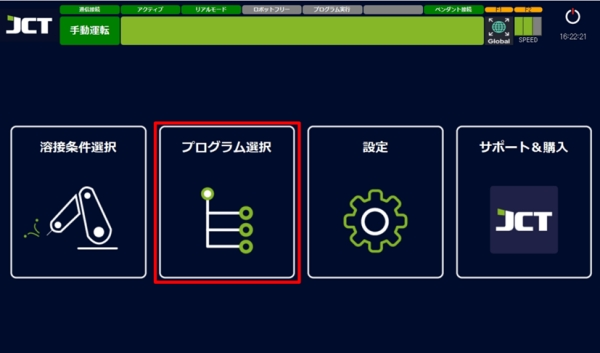
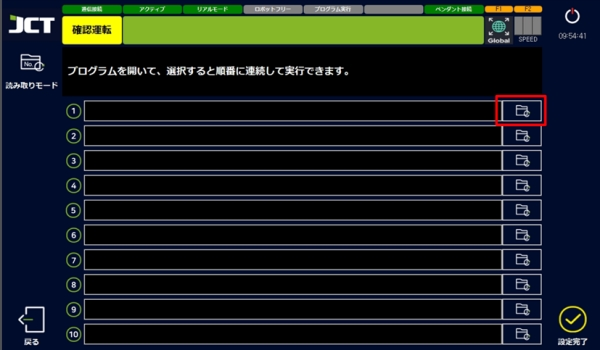
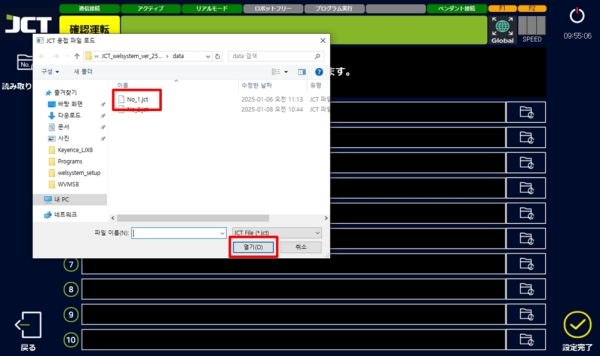
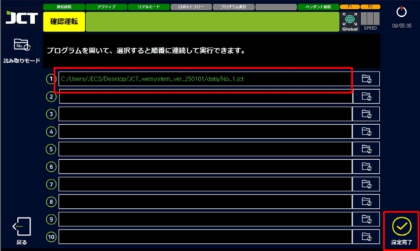
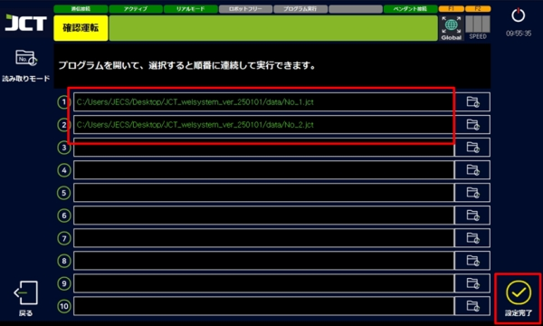
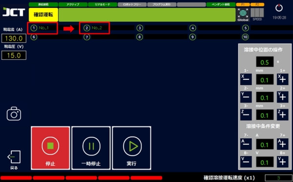
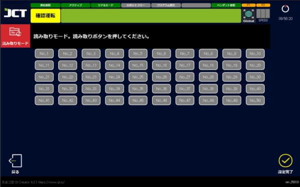
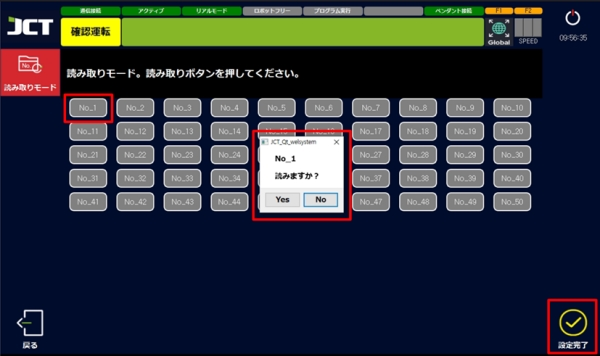

# 10.4. プログラムの読み取り

#### ■ 直接読み取る方法



メイン画面から「プログラム選択」を押します。

<figure><figcaption></figcaption></figure>



「読み取り」ボタンを押せばウィンドウエクスプローラが表示されます。

<figure><figcaption></figcaption></figure>



DATAフォルダの中のプログラムを選択して開きます。

<figure><figcaption></figcaption></figure>



設定完了を選択して読み取ることが出来ます。

<figure><figcaption></figcaption></figure>



複数のプログラムを読み取ることも可能です。

<figure><figcaption></figcaption></figure>



この場合、上から順番に行っていきます。

<figure><figcaption></figcaption></figure>



***

#### ■ 読み取りモードの使用



画面の左上の「読み取りモード」ボタンを選択します。

<figure><figcaption></figcaption></figure>



実行させるプログラムの番号を選択した後、設定完了を行います。

<figure><figcaption></figcaption></figure>


