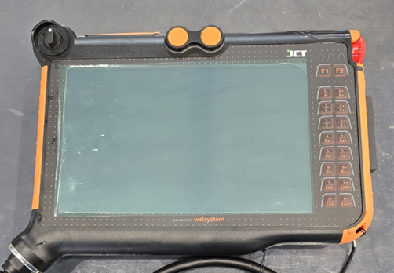

# 2.2. システム構成

* **ロボットコントローラー**

<table data-card-size="large" data-view="cards"><thead><tr><th></th><th data-hidden data-card-cover data-type="files"></th><th data-hidden data-card-target data-type="content-ref"></th></tr></thead><tbody><tr><td>Standard Control Box (CB06)</td><td><a href="../.gitbook/assets/그림9.png">그림9.png</a></td><td><a href="standard-control-box-cb06.md">standard-control-box-cb06.md</a></td></tr></tbody></table>

* **ロボット**

<table data-card-size="large" data-view="cards"><thead><tr><th></th><th data-hidden data-card-cover data-type="files"></th></tr></thead><tbody><tr><td>RB3-1200 (RAINBOWROBOTICS)</td><td><a href="../.gitbook/assets/그림10.png">그림10.png</a></td></tr><tr><td>RB10-1300 (RAINBOWROBOTICS)</td><td><a href="../.gitbook/assets/그림11.png">그림11.png</a></td></tr></tbody></table>

* **溶接機**

<table data-view="cards"><thead><tr><th></th><th data-hidden data-card-cover data-type="files"></th></tr></thead><tbody><tr><td>OTC DAIHEN</td><td><a href="../.gitbook/assets/그림12.png">그림12.png</a></td></tr><tr><td>HYOSUNG</td><td><a href="../.gitbook/assets/그림13.png">그림13.png</a></td></tr><tr><td>ESAB</td><td><a href="../.gitbook/assets/그림14.png">그림14.png</a></td></tr></tbody></table>

* **ティーチングペンダント**

<figure><figcaption>
製品の需要に問題がある場合は、代替品が適用されることがあります。
</figcaption></figure>
