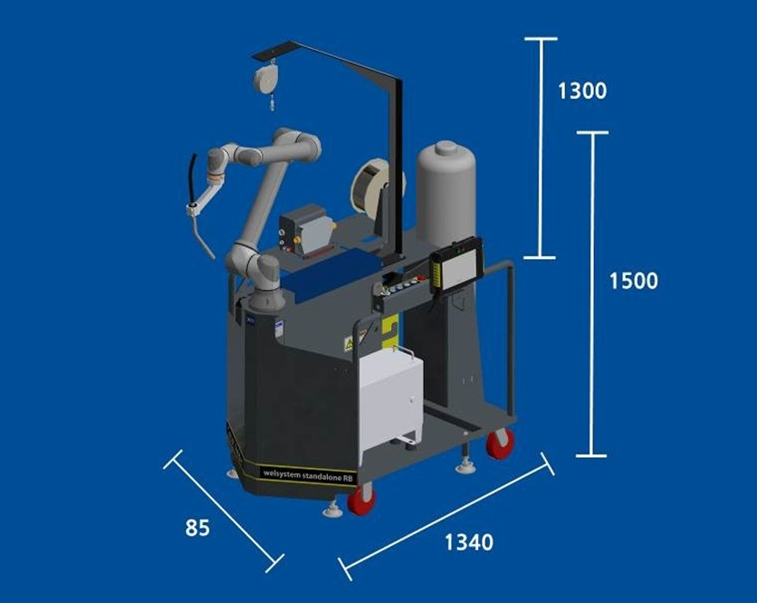
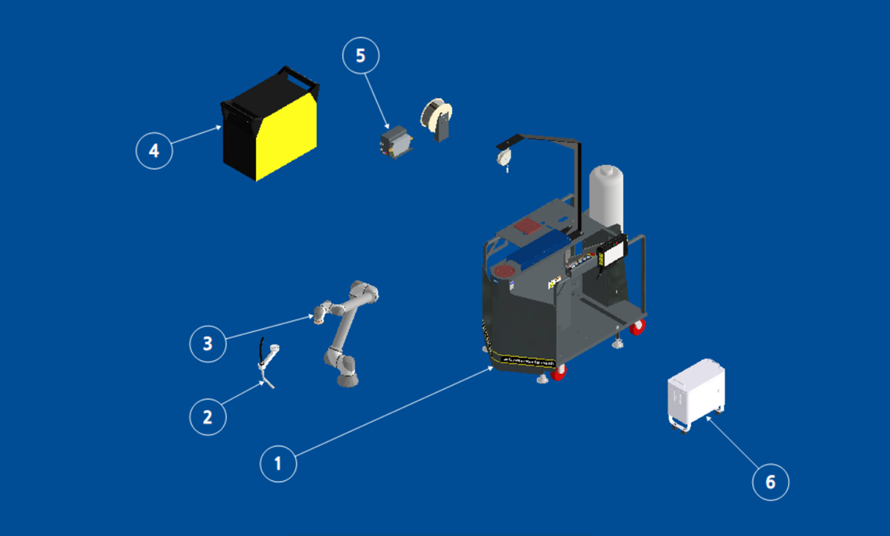

# 2.3. 製品構成要約

* **製品サイズ**

<figure><figcaption></figcaption></figure>

* **製品詳細**

<figure><figcaption></figcaption></figure>

> 1.  FRAME\
>     ROBOTや溶接機など 溶接に必要な装備を乗せる溶接パッケージです。
>
>     ホイールと レベルパットが付いており移動と固定が可能です。
> 2.  Torch Ass'y\
>     構成として、TORCH BODY、TORCH CABLE、TORCH NECKがあります。
>
>     TORCH BODYとTORCH CABLEは顧客仕様により異なる場合があります。
>
>     TORCH NECKはTORCH BODYを固定する役割をします。
> 3. ROBOT\
>    ROBOTは溶接姿勢を助け、簡単に操作でき、繰り返し性と精度が高いです。
> 4. 溶接機\
>    顧客の要求に応じて変更可能です。
> 5. WIRE FEEDER\
>    WIRE供給装置として、溶接機の種類によって形状や仕様が変わります。
> 6. ROBOT CONTROLLER\
>    ROBOTをコントロールするためのデバイスです。
