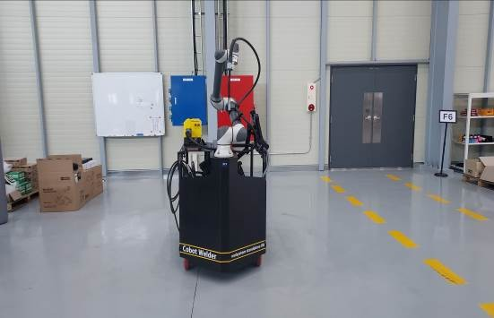
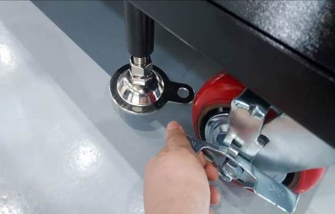
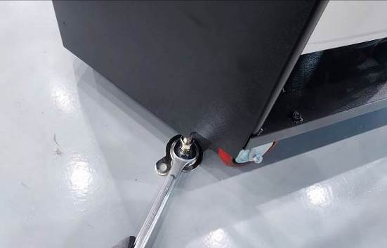
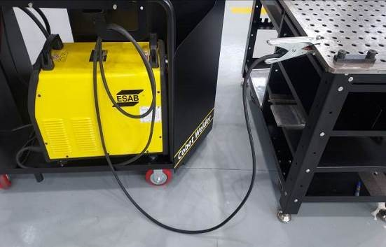

# 3.1. プレームの設置

1.  製品を目的の位置に移動します。\

    
<figure><figcaption></figcaption></figure>

2.  背面のホイール2本を固定します。\

    
<figure><figcaption></figcaption></figure>

3.  レベルパッドを下げて位置を固定します。\

    
<figure><figcaption></figcaption></figure>

4.  溶接定盤にアースを接続します。\

    
<figure><figcaption></figcaption></figure>

