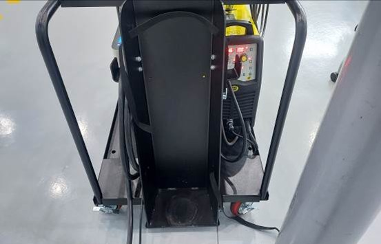
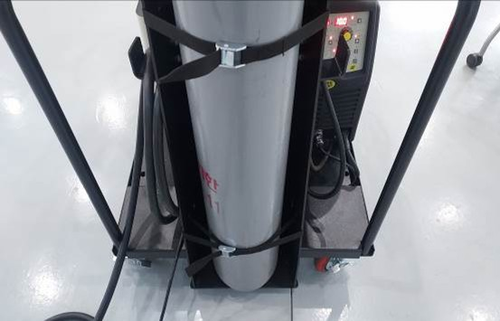
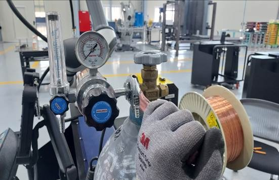
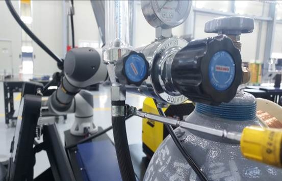
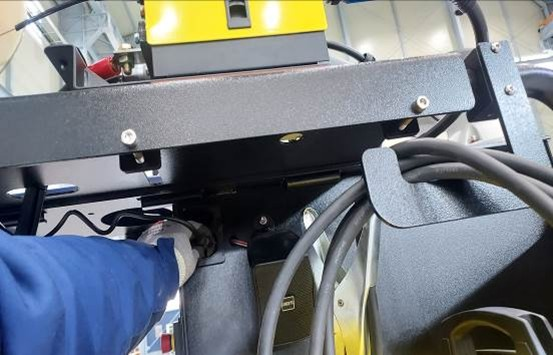

# 3.4. ガス接続

1.  準備したガスをフレームの背面に置きます。\

    
<figure><figcaption></figcaption></figure>

2.  固定バーでガスを固定させます。\

    
<figure><figcaption></figcaption></figure>

3.  ガス調整器をガス容器に取り付けます。\

    
<figure><figcaption></figcaption></figure>

4.  ホースをガスコントローラに接続します。\

    
<figure><figcaption></figcaption></figure>

5.  ガスコントローラのプラグをコンセントに差し込みます。\

    
<figure><figcaption></figcaption></figure>

