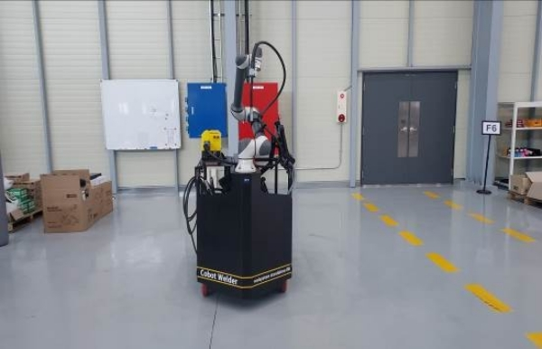
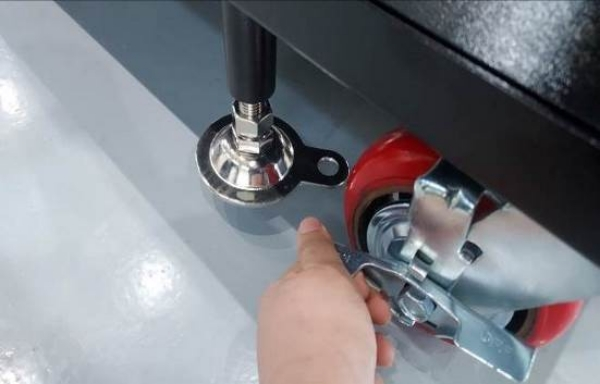
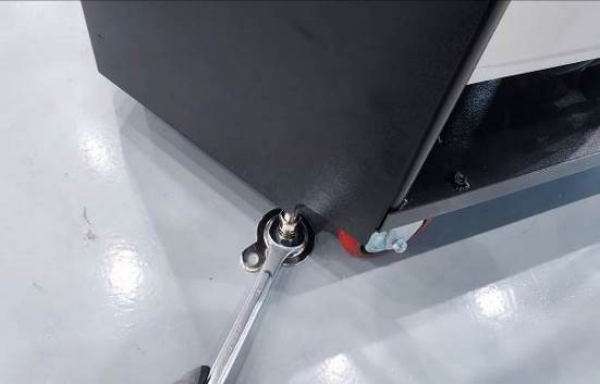
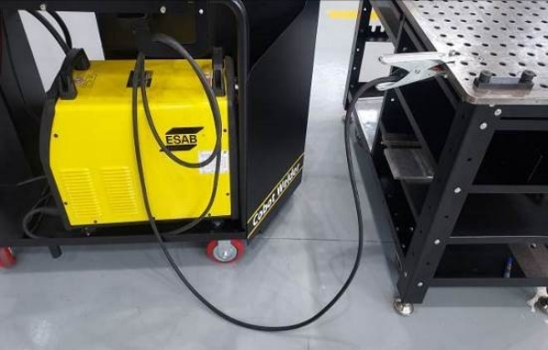

# 3.1. プレームの設置



製品を目的の位置に移動します。

<figure><figcaption></figcaption></figure>



背面のホイール2本を固定します。

<figure><figcaption></figcaption></figure>



レベルパッドを下げて位置を固定します。

<figure><figcaption></figcaption></figure>



溶接定盤にアースを接続します。

<figure><figcaption></figcaption></figure>


