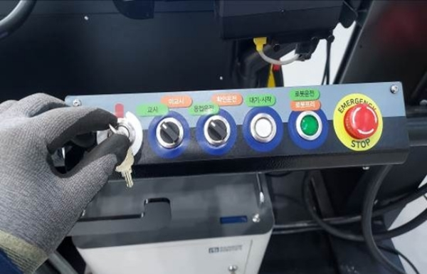
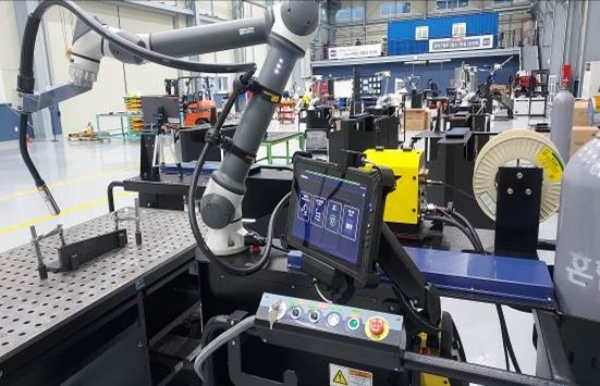

# 3.1 부팅



전원용 키 스위치를 ON 시킵니다.

● JWS(독립이동형)\_구형타입

<figure><figcaption></figcaption></figure>

● JWS(독립이동형)\_신형타입

<figure><figcaption></figcaption></figure>

● JWT, JWF(테이블형, 지정 설치형)

<figure><figcaption></figcaption></figure>

● JWG(겐츄리형)

<figure><figcaption></figcaption></figure>



용접기의 전원을 입력합니다.

● TRANSMIG SERISE(EASB)\_후면 상부

<figure><figcaption></figcaption></figure>

● DAIHAN 350(DAIHAN)\_전면 하부

<figure><figcaption></figcaption></figure>

● EX-TRAFIRE 105HD(EX-TRAFIRE)\_후면 상부

<figure><figcaption></figcaption></figure>



가스통 밸브를 열어줍니다.

<figure><figcaption></figcaption></figure>



welsystem 을 실행시킵니다.

<figure><figcaption></figcaption></figure>



기동이 완료 됩니다.

<figure><figcaption></figcaption></figure>


