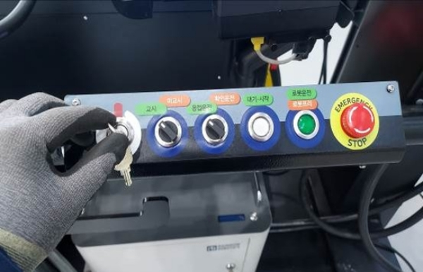

# 3.2 Shutdown



Shut down the welsystem.

<figure><figcaption></figcaption></figure>



Switch the key switch to OFF.

<figure><figcaption></figcaption></figure>



Disconnect the power of the welding machine.

<figure><figcaption></figcaption></figure>



Lock the valve of the gas cylinder.

<figure><figcaption></figcaption></figure>


