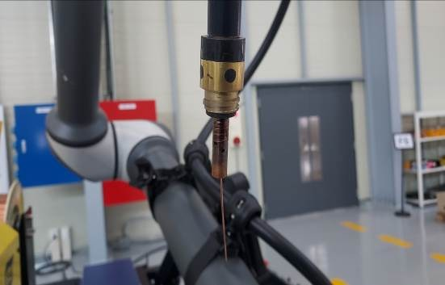
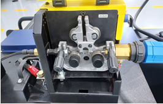
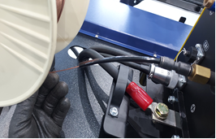
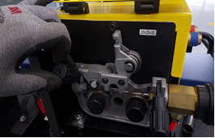
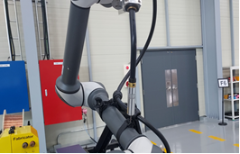

# 3.3. ワイヤ接続



ワイヤ取付台にワイヤを取り付けます。

<figure><figcaption></figcaption></figure>



ワイヤが入りやすいようにノズルとチップを取り外します。

<figure><figcaption></figcaption></figure>



フィーダのローラーを緩めます。

<figure><figcaption></figcaption></figure>



ワイヤーをトーチの端まで押し込みます。

<figure><figcaption></figcaption></figure>



ワイヤがトーチの端に出たら、ワイヤフィーダのローラを固定します。

<figure><figcaption></figcaption></figure>



最後に、トーチノズルとチップを再組み立てします。

<figure><figcaption></figcaption></figure>



