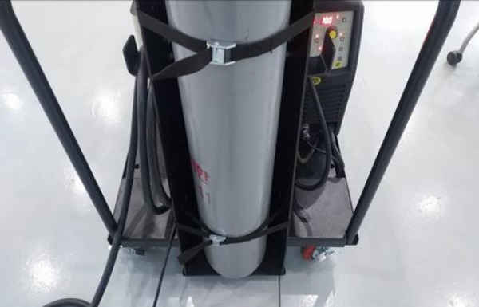

# 3.4. ガス接続



準備したガスをフレームの背面に置きます。

<figure><figcaption></figcaption></figure>



固定バーでガスを固定させます。

<figure><figcaption></figcaption></figure>



ガス調整器をガス容器に取り付けます。

<figure><figcaption></figcaption></figure>



ホースをガスコントローラに接続します。

<figure><figcaption></figcaption></figure>



ガスコントローラのプラグをコンセントに差し込みます。

<figure><figcaption></figcaption></figure>


