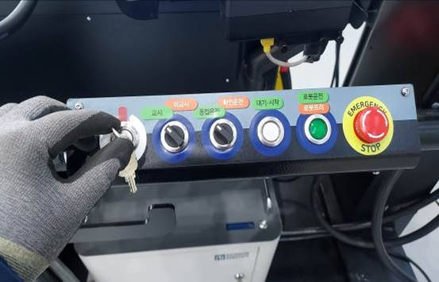
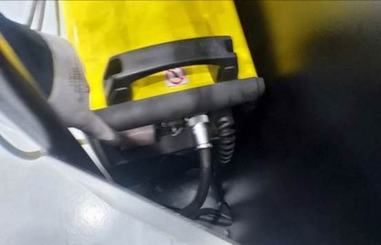
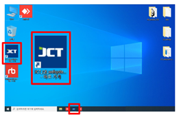

# 4.1. ブート

1.  スイッチボックスのキースイッチをオンにします。\

    
<figure><figcaption></figcaption></figure>

2.  溶接機の電源を入れます。\

    
<figure><figcaption></figcaption></figure>

3.  welsystem プログラムを実行します。\

    
<figure><figcaption></figcaption></figure>

4.  ガス筒のバルブを開きます。\

    
<figure><figcaption></figcaption></figure>

5.  起動が完了します。

    (ロボットネットワーク接続+自動起動+リアルモード)\

    
<figure><figcaption></figcaption></figure>

