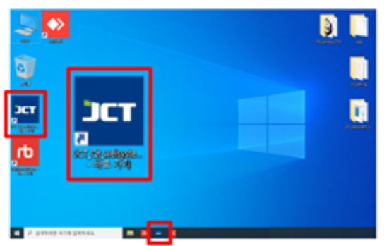
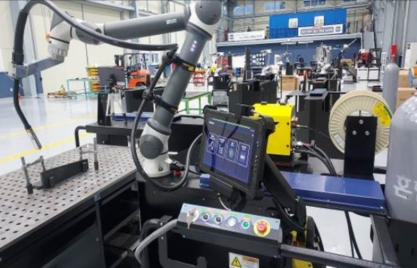

# 4.1. ブート



スイッチボックスのキースイッチをオンにします。

<figure><figcaption></figcaption></figure>



溶接機の電源を入れます。

<figure><figcaption></figcaption></figure>



ガス筒のバルブを開きます。

<figure><figcaption></figcaption></figure>



welsystem プログラムを実行します。

<figure><figcaption></figcaption></figure>



起動が完了します。

(ロボットネットワーク接続+自動起動+リアルモード)

<figure><figcaption></figcaption></figure>


