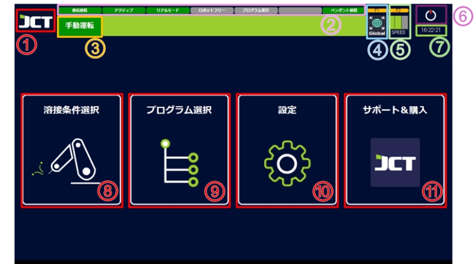
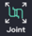

# 4.1 메인화면

<figure><figcaption></figcaption></figure>

> 1. 로고\
>    회사 로고 입니다.\
>    터치 시, PC 의 바탕화면으로의 전환이 가능합니다.
> 2. 스테이터스바\
>    시스템의 정보를 간단하게표시합니다.
> 3. 실행모드\
>    기기의현재모드를표시합니다.\
>    수동운전, 확인운전, 용접운전의 3가지 모드가 있으며, 아이콘을 터치하면 모드가 변경됩니다.
> 4.  좌표계 선택\
>     팬던트를 이용한 로봇 조작 시 기준이 되는 좌표계를 선택합니다.
>
>     <table><thead><tr><th width="66"></th><th width="197"></th><th></th></tr></thead><tbody><tr><td></td><td>Joint 좌표계</td><td>로봇의 각 관절을 하나씩 움직일 수 있습니다.</td></tr><tr><td></td><td>関節座標系</td><td>ロボットの各関節を動かす座標系です。</td></tr><tr><td></td><td>Global 좌표계</td><td>로봇 중심을 기준으로 수직, 수평으로 직선 방향으로 움직입니다.</td></tr><tr><td></td><td>Tool 좌표계</td><td>로봇 툴(토치) TCP를 기준으로 수직, 수평으로 직선 방향으로 움직입니다.</td></tr></tbody></table>
>
>     팬던트의 "F1" 버튼으로도 좌표계를 변경할 수 있습니다.
> 5.  수동속도\
>     로봇의 수동 조작 속도를 표시합니다.
>
>     저속, 중속, 고속의 3단계 조절이 가능합니다.
>
>     펜던트의 "F2" 버튼을 누르거나 화면의 버튼을 터치하여 변경할 수 있습니다.
>
>     (프로그램의 동작 속도에는 영향을 주지 않습니다.)
> 6. 종료\
>    로봇을 비활성화하여 프로그램을 종료합니다.。
> 7. 시계\
>    현재 시각을 표시합니다.
> 8. 용접 조건 선택\
>    용접 프로그램을 작성할 화면을 이동합니다.
> 9. 프로그램 선택\
>    작성한 프로그램을 가져올 화면을 이동합니다.
> 10. 설정\
>     설정 화면으로 이동합니다.
> 11. 지원 구매\
>     준비중입니다.
