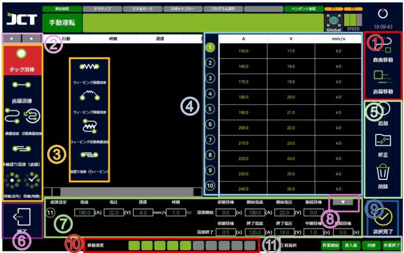
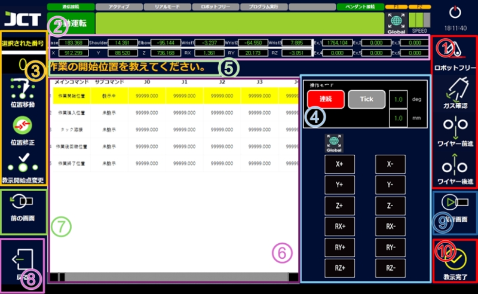
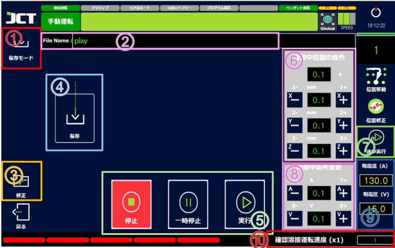

# 7.2. 溶接選択画面

#### ■ 溶接選択画面

<figure><figcaption></figcaption></figure>

> 1. 移動
>    溶接以外のロボットの移動に必要な動作を追加します。
>
> 2. 動作変換
>    さまざまな溶接方法や条件などを追加できます。
>
> 3. プログラムウィンドウ
>    現在作成中の溶接プログラムの動作と条件を確認できます。
>
> 4. 溶接条件選択リスト
>    設定で事前に保存した溶接条件を選択できます。
>
> 5.  編集
>
>     動作や条件を追加・修正・削除することができます。
>
> 6.  戻る
>
>     メイン画面に移動します。
>
> 7.  溶接条件直接設定
>
>     保存された溶接条件に加えて、直接溶接条件を設定して溶接を実行できます。
>
> 8.  溶接条件上書き
>
>     現在自分で設定した溶接条件を溶接条件選択リストに上書きできます。
>
> 9.  選択完了
>
>     溶接条件の作成を完了し、教示画面に移動します。
>
> 10. プログラム動作速度調節バー
>
>     プログラムが動作しているとき、溶接モーション以外の速度を調整できます。
>
>     速度調節バーは全部で10個で、1つあたり10パーセント速度、10個なら100パーセントです。　（溶接速度には反映されません。）
>
> 11. プロセス選択
>
>     溶接プログラムの溶接前後の待機および回避動作を有効または無効にできます。
>
>     アクティブなときはランプが緑色で、無効なときは灰色で表示されます。

***

#### ■ 教示画面

<figure><figcaption></figcaption></figure>

> 1.  手動テスト
>
>     ロボットフリー機能と溶接機の手動操作機能を実行できます。
>
>     （溶接機によって外部信号をサポートしない場合や動作しないことがあります。）
>
> 2.  ロボット座標表示
>
>     現在のロボットの各関節角度と直交座標系の座標値を表示します。
>
> 3.  教示編集
>
>     修正したい位置を選択した後、その位置に移動したり("位置移動")、変更された位置を保存("位置修正")することができます。
>
>     連続修正の場合は、修正を開始する場所を選択し、「授業開始点の変更」をクリックします。選択位置から順に修正が可能になります。
>     (ロボットフリー状態でない場合のみ動作します。)
>
> 4.  手動操作パネル
>
>     ロボットフリーではなく、ペンダント操作でロボットを移動できるパネルです。
>     連続 - 押しながら移動、TICK - 設定された数値だけ移動
>
> 5.  教示位置説明ウィンドウ
>
>     教えるべき作業を音声とともに教えてくれます。
>
> 6.  プログラムウィンドウ
>
>     設定された溶接動作と現在の教示状態などを確認することができます。
>
> 7.  前画面へ
>
>     教示された値を保持し、「溶接選択画面」に移動します。
>
> 8.  戻る
>
>     前の授業の位置に戻ります。
>     （戻る位置がない場合は、「溶接選択画面」に戻ります。）
>
> 9.  実行画面
>
>     教示された値を変えずに \[実行画面] に移動します。
>     （教示されない地点があれば動作しません。）
>
> 10. 教示完了
>
>     現在のロボットの位置を教示します。
>     （すべての位置が教示されたら「実行画面」に移動します。）

***

#### ■ プログラム実行画面

<figure><figcaption></figcaption></figure>

> 1.  保存モード
>
>     作成したプログラムを指定されたスペースに保存する機能です。 (50個まで可能)
>
> 2.  プログラム名
>
>     現在のプログラム名を表示します。
>
>     名前をタッチすると、プログラム名を変更できます。
>
> 3.  修正
>
>     教示された値を保持したまま、「溶接条件選択画面」に移動します。
>
> 4.  保存
>
>     現在のプログラムを"②"の名前で保存します。
>
>     (プログラムの位置はDATAフォルダの内部にある必要があります。)
>
> 5.  プログラム動作
>
>     プログラムを実行・一時停止・完全停止することができます。
>
>     一時停止中は作業をつなげることができますが、完全停止すると最初から実行します。
>     「手動運転」はプログラムが実行されません。
>
> 6.  溶接中位置操作
>
>     溶接中に設定された数値だけ座標値を変更できます。
>
>     ティーチングペンダントの「X±・Y±・Z±」ボタンでも変更できます。
>
> 7.  中途実行
>
>     設定した数字の教示位置からプログラムを実行します。
>
> 8.  溶接中の条件変更
>
>     溶接する途中で設定された数値だけ溶接条件を変更できます。
>
>     ティーチングペンダントの「7±・8±」ボタンでも変更できます。
>
> 9.  電圧/電流表示
>
>     現在出力されている電圧/電流指令値を表示します。
>
>     (実際の出力値と異なる場合があります。)
>
> 10. 確認溶接運転速度(x1)設定
>
>     確認運転時の動作速度を設定できます。 （倍速に設定されます。）
