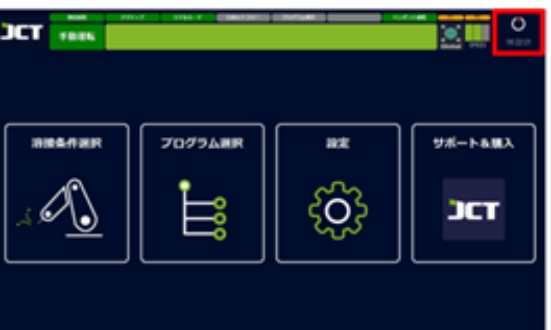
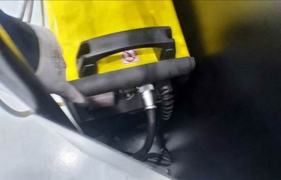
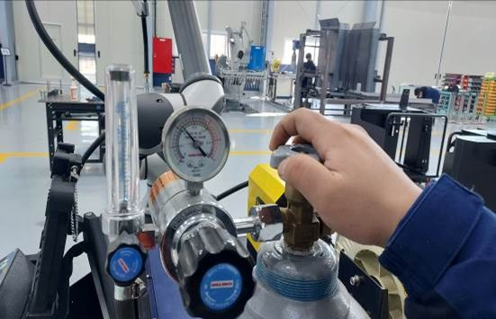

# 4.2. シャットダウン



welsystem プログラムを終了します。

<figure><figcaption></figcaption></figure>



スイッチボックスのキースイッチをOFFに変更します。

<figure><figcaption></figcaption></figure>



溶接機の電源を切ります。

<figure><figcaption></figcaption></figure>



ガス筒のバルブを閉じます。

<figure><figcaption></figcaption></figure>


