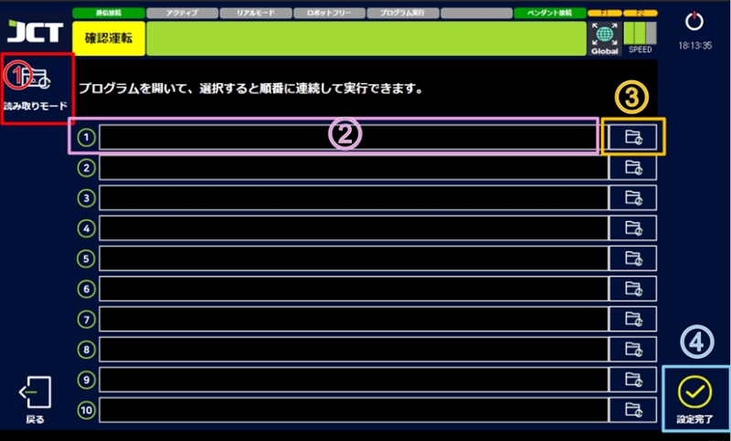
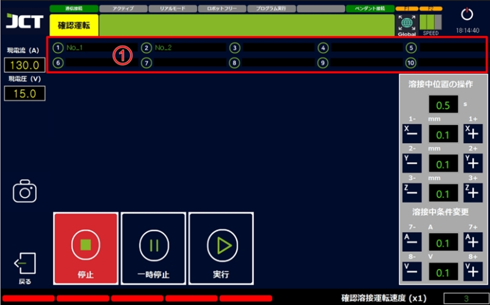

# 4.3 프로그램선택

#### ■ 프로그램 선택 화면

<figure><figcaption></figcaption></figure>

> 1.  読み取りモード
>
>     保存されたプログラムをすばやく読み込むことができます。
> 2.  選択したプログラム表示ウィンドウ
>
>     選択したプログラムの名前と保存パスを表示するウィンドウです。
> 3.  読み込み
>
>     保存されたプログラムを読み込むことができます。
> 4.  設定完了
>
>     読み込んだプログラムの実行画面に移動します。

***

#### ■ 多重プログラム実行

<figure><figcaption></figcaption></figure>

> *   多重プログラム表示ウィンドウ
>
>     複数のプログラムを複数選択することができ、順番に実行します。
