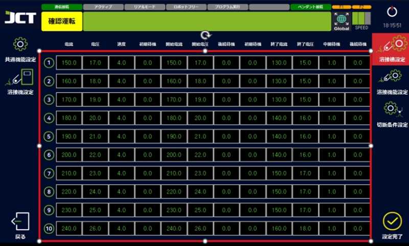
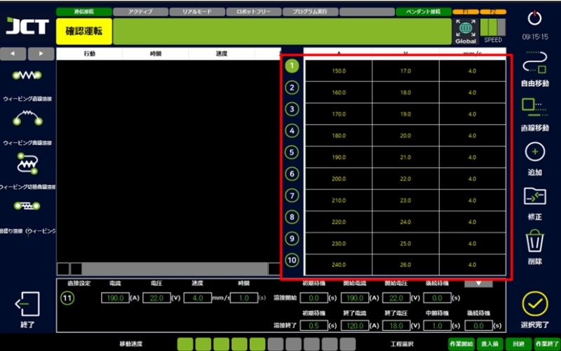
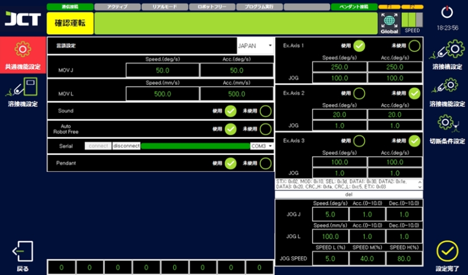
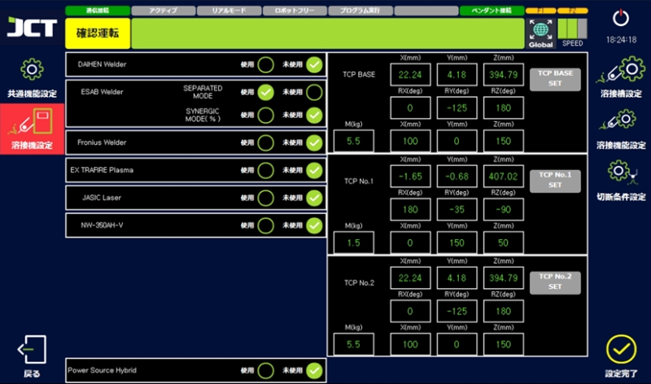
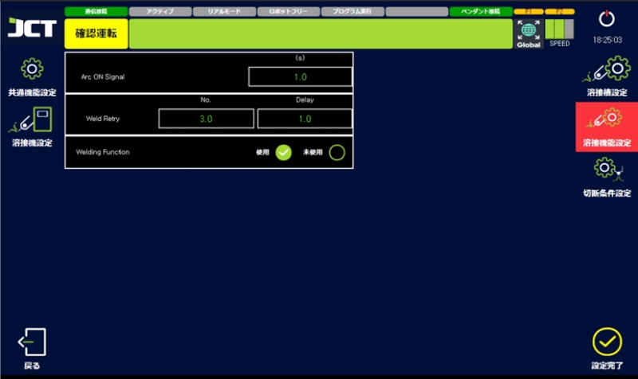

# 4.4 설정

#### ■ 용접조건설정

頻繁に使用する溶接条件データを事前に保存できます。

<figure><figcaption></figcaption></figure>

> * 各項目を選択すると、値を変更できます。
> *   溶接条件は10個まで保存できます。
>
>     （設定完了を押さなければ保存されません。）

<figure><figcaption>
※ 保存した条件を確認できます。
</figcaption></figure>

***

#### ■ 공통기능설정화면

<figure><figcaption></figcaption></figure>

> *   言語設定
>
>     使用する言語を変更することができます。(韓国語、英語、日本語)
>
>     正常に適用するにはプログラムの再起動が必要です。
> *   MOVJ（自由移動） 速度
>
>     作業の開始位置、終了位置など、自由移動速度および加減速を設定できます。
> *   MOVL(直線移動) 速度
>
>     作業進入前と完了後の回避位置など直線移動速度および加減速を設定できます。
> *   SOUND
>
>     教示案内音声を使用するかどうかを設定することができます。
> *   Auto Robot Free
>
>     教示のときに自動的にロボットフリーにさせる機能の使用可否を設定できます。
> *   Serial
>
>     ティーチングペンダントの通信接続の有無を設定できます。
>
>     正常なときは表示バーが緑色で、通信非接続状態では灰色になります。
>
>     （基本設定ポート:COM3）
> *   Ex.Axis 1 \~ 3
>
>     付加軸が適用された場合、該当機能を通じて活性化することができます。
>
>     注意:任意の使用時に問題が発生することがあります。

***

#### ■ 전원 / TCP 설정화면

<figure><figcaption></figcaption></figure>

> *   連動機器設定
>
>     溶接機または切断機を選択できます。
>
>     出荷時に設定された設定値の維持をお勧めします。
> *   Power Source Hybrid
>
>     ハイブリッドタイプ製品の連動機器間の電源交換の可否を設定できす。
>
>     変更の際、使用する装備の製品名を正確に確認してから変更してください。
> *   TCP設定
>
>     ロボットツールのTCP を設定します。
>
>     出荷時に設定された設定値の維持をお勧めします。

***

#### ■ 용접기설정화면

<figure><figcaption></figcaption></figure>

> *   Arc ON Signal
>
>     溶接時のアーク発生待機時間を設定できます。
> *   Weld Retry
>
>     溶接アークが発生しない場合は、再実行回数と待機時間を設定できます。
> *   Welding Function
>
>     「溶接中位置操作」、「溶接中条件変更」機能の使用可否を設定できます。
