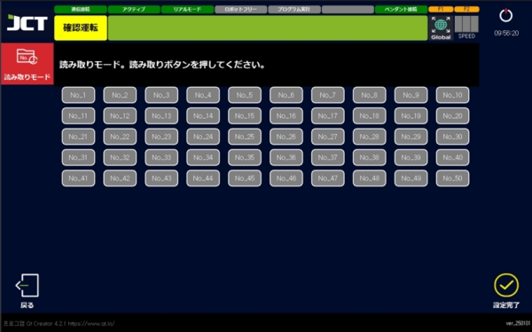

# 5.5.2 프로그램 읽기

#### ■ 직접 읽기



메인 화면에서 '프로그램 선택'을 누릅니다.

<figure><figcaption></figcaption></figure>



읽기 버튼을 누르면 창 탐색기가 나타납니다.

<figure><figcaption></figcaption></figure>



DATA 폴더 안의 프로그램을 선택하여 엽니다.

<figure><figcaption></figcaption></figure>



설정 완료를 선택해 읽을 수 있습니다.

<figure><figcaption></figcaption></figure>



여러 프로그램을 읽을 수도 있습니다.

<figure><figcaption></figcaption></figure>



이 경우 위에서부터 차례로 진행합니다.

<figure><figcaption></figcaption></figure>



***

#### ■ 읽기 모드 사용



화면의 왼쪽 상단의 「읽기 모드」버튼을 선택합니다.

<figure><figcaption></figcaption></figure>



실행시킬 프로그램의 번호를 선택한 후 설정 완료를 진행합니다.

<figure><figcaption></figcaption></figure>


