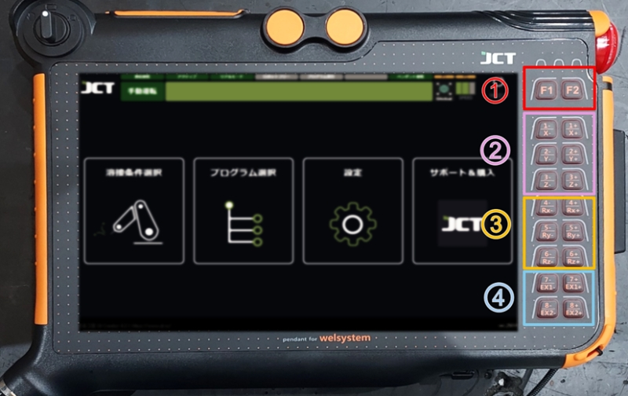
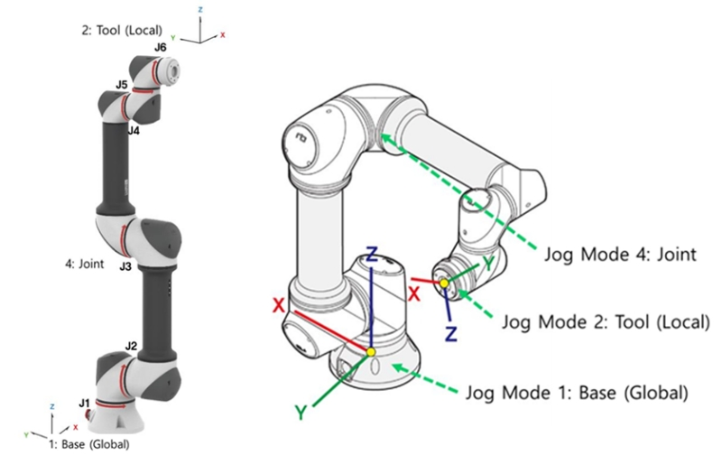

# 5.1.2 팬던트 교시

#### ■ 팬던트 교시

티칭 펜던트의 오른쪽에 있는 버튼을 조작하여 교시 위치로 이동하는 방법이며, \
조작 방법에는 "Joint", "Global", "Local" 세 가지가 있습니다.

<figure><figcaption>
＜ティーチングペンダントの手動操作ボタン＞
</figcaption></figure>

* F1(좌표계 전환 버튼): 버튼을 누르면 좌표계를 전환합니다.

<table><thead><tr><th width="66"></th><th width="197"></th><th></th></tr></thead><tbody><tr><td></td><td>Joint</td><td>로봇의 각 관절을 움직이는 좌표계</td></tr><tr><td></td><td>Global</td><td>로봇중심을기준으로가로,세로,수직으로움직이는좌표계</td></tr><tr><td></td><td>Tool</td><td>로봇 TCP를 기준으로 가로, 세로로 수직으로 움직이는 좌표계</td></tr></tbody></table>

* F2(수동 속도 전환 버튼): 버튼을 누르면 3개의 속도로 전환합니다.

<table><thead><tr><th width="66"></th><th width="197"></th><th></th></tr></thead><tbody><tr><td></td><td>저속</td><td>기본속도 10%</td></tr><tr><td></td><td>중속</td><td>기본속도 40%</td></tr><tr><td></td><td>고속</td><td>기본속도 70%</td></tr></tbody></table>


환경설정에서 속도 변경이 가능합니다.


* 1± \~ 3± / X± \~ Z± (수동 조작 버튼1) \
  (용접 프로그램 동작중의 용접중의 위치 조작 기능에도 사용됩니다.)

<table><thead><tr><th width="66"></th><th width="197"></th><th></th></tr></thead><tbody><tr><td></td><td>Joint</td><td>J1, J2, J3 관절을 ± 방향으로 제어합니다.</td></tr><tr><td></td><td>Global</td><td>직교 X·Y·Z를 ±방향으로 제어합니다.</td></tr><tr><td></td><td>Tool</td><td>토치의 선단을 기준으로 X·Y·Z를 ±방향으로 제어합니다.</td></tr></tbody></table>

* 4± \~ 6± / RX± \~ RZ± (수동 조작 버튼 2)

<table><thead><tr><th width="66"></th><th width="197"></th><th></th></tr></thead><tbody><tr><td></td><td>Joint</td><td>J4, J5, J6 관절을 ± 방향으로 회전합니다.</td></tr><tr><td></td><td>Global</td><td>직교 RX·RY·RZ를 ±방향으로 회전합니다.</td></tr><tr><td></td><td>Tool</td><td>토치의 선단을 기준으로 RX·RY·RZ를 ±방향으로 회전합니다.</td></tr></tbody></table>

*   EX 1± \~ 2±(부가축 수동 조작 버튼) 부가축 1±2±에 대한 수동 조작 버튼(부가축을 적용했을 때 유효합니다.)

    용접 프로그램 동작 중인 경우 용접 중 조건 변경 기능에도 사용됩니다.

<figure><figcaption>
&#x3C; 좌표계참고>
</figcaption></figure>
