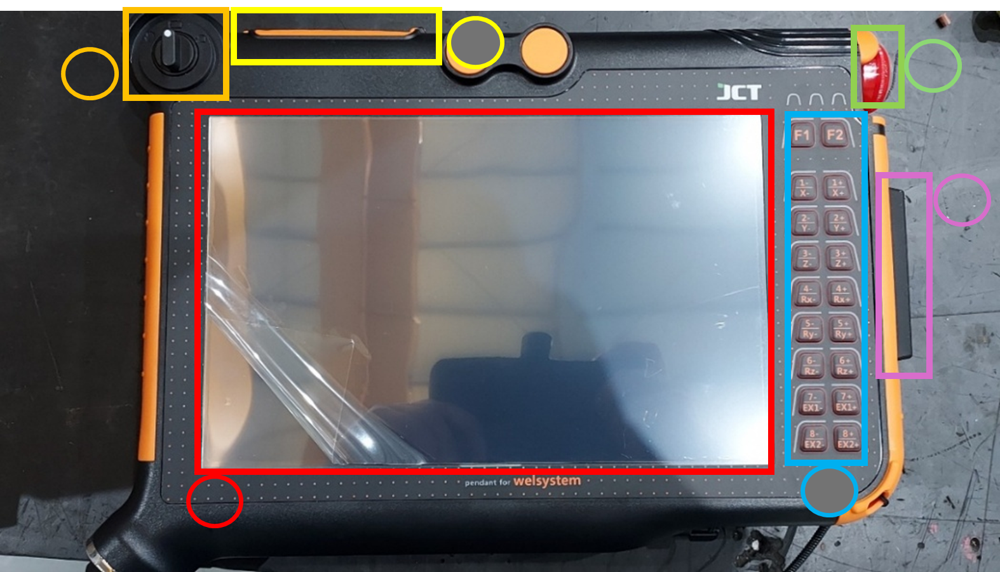

# 5.1. ティーチングペンダント

<figure><figcaption></figcaption></figure>

1.  メイン画面\
    減圧式パネルが適用された画面です。

    ペンダントの下にタッチペンが付いてあります。
2. モード・セレクト・スイッチ\
   左から手動操作、確認モード、溶接モードとなります。
3. 外部接続ポート\
   カバーの下にはUSBポートなど、外部機器と繋げるポートがあります。
4. 緊急停止スイッチ\
   スイッチを押すと、現在動作中の溶接プログラムが終了します。
5.  ロボット操作パネル\
    ペンダントでロボットの操作方法、操作速度など直接制御できるパネルです。.

    （手動モード状態でロボットフリー状態でない場合のみ動作します。）
6. プログラム・スタート・スイッチ\
   スイッチを押すと設定済みのプログラムが実行します。

