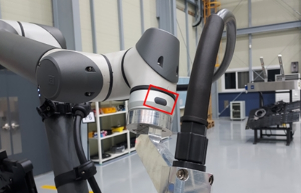
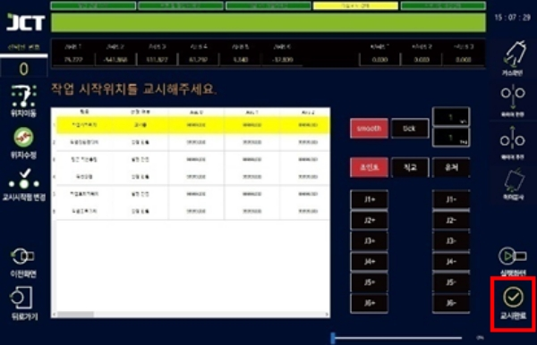

# 5.1 조작 및 교시 방법

교시 버튼을 눌러 로봇의 현재 좌표를 프로그램의 해당 위치에 저장할 수 있습니다.

<figure><figcaption>
&#x3C;직접교시 버튼>
</figcaption></figure>

<figure><figcaption>
&#x3C;팬던트 교시버튼>
</figcaption></figure>


**올바른 교시 방법**

팁 끝에서 용접 와이어를 15mm 정도 노출시킨 후 와이어 끝 점을 용접을 원하는 위치에 맞게 교시해 주세요.

