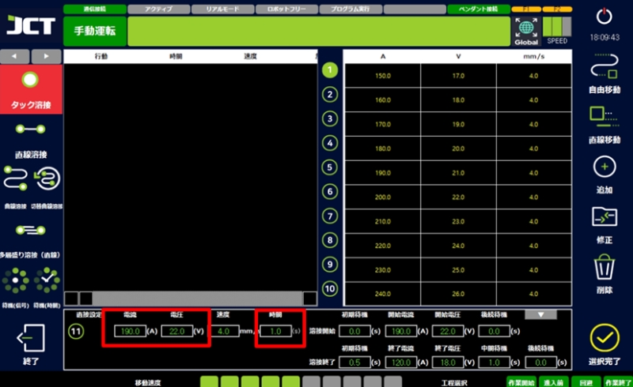
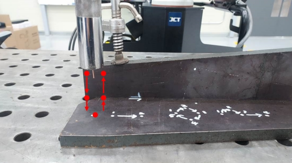
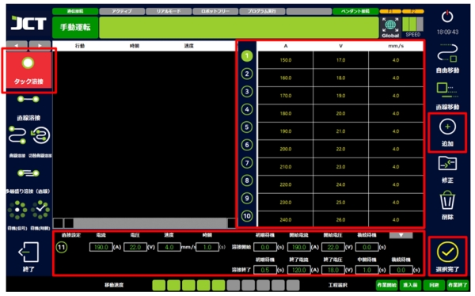
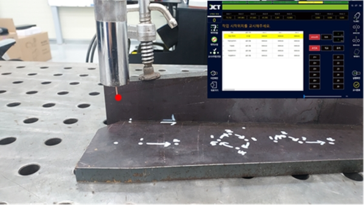
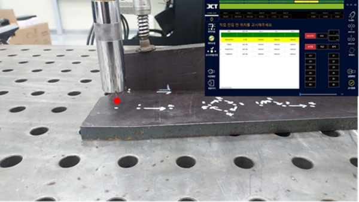
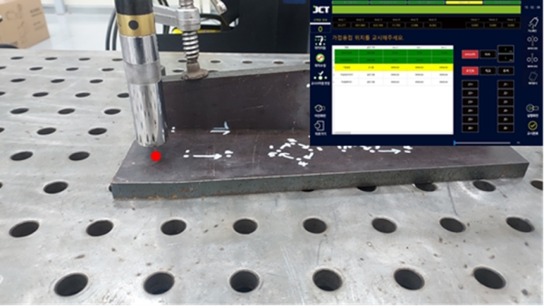
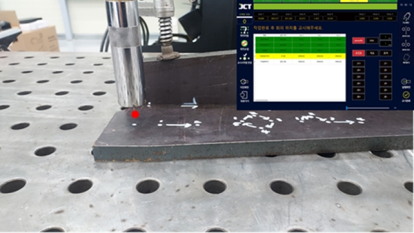
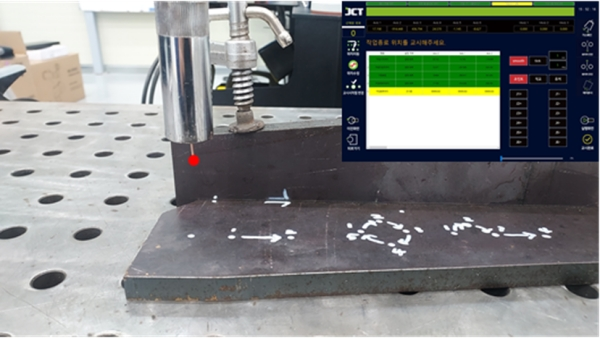

# 5.2.1 가접용접

가접용접은 본 용접 전에 소재의 고정 또는 열 변형 방지를 위해 사용하는 기능입니다. 전류(A), 전압(V), 시간(sec)의 조건을 설정합니다. 교시 화면에서는 하나의 포인트가 생성됩니다.

<figure><figcaption></figcaption></figure>

#### ■ 가접용접 예시



가접 작업을할 포인트를 설정합니다.

<figure><figcaption></figcaption></figure>



메인 화면에서 용접 선택을 클릭합니다.

<figure><figcaption></figcaption></figure>



가접용접 > 용접조건 선택 >추가 > 설정 완료를 실시합니다.

<figure><figcaption></figcaption></figure>



작업의 시작 위치를 교시합니다.

<figure><figcaption></figcaption></figure>



작업 진입 전 위치를 교시합니다.

<figure><figcaption></figcaption></figure>



가접 용접 위치를 교시합니다.

<figure><figcaption></figcaption></figure>



작업 완료 후 회피 위치를 교시합니다.

<figure><figcaption></figcaption></figure>



작업 종료 위치의 교시합니다.

<figure><figcaption></figcaption></figure>



실행 버튼을 눌러 용접을 실시합니다.(모드 확인!)

<figure><figcaption></figcaption></figure>


