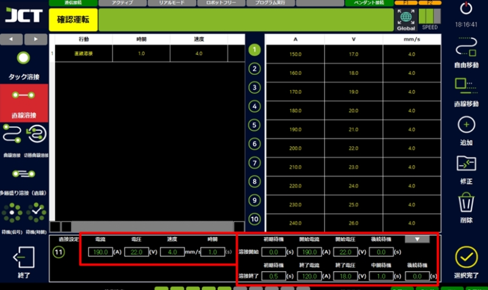

# 5.2.2 직선용접

직선 용접은 일직선의 용접이 필요한 경우에 사용합니다.

용접중의 전류(A)·전압(V)·속도(mm/s), 용접의 개시와 종료 시점의 전류·전압·IDLE 시간을 설정할 수 있습니다. 교시 화면에서는 용접 시작점과 끝점의 2개의 포인트가 생성됩니다.&#x20;

연속으로 용접을 하는 경우는 1개씩 포인트가 추가됩니다.

<figure><figcaption></figcaption></figure>

#### ■ 직선용접예시



직선 용접할 포인트를 설정합니다.

<figure><figcaption></figcaption></figure>



메인 화면에서 용접 선택을 클릭합니다.

<figure><figcaption></figcaption></figure>



직선용접 > 용접조건 선택 >추가 > 설정 완료를 실시합니다.

<figure><figcaption></figcaption></figure>



작업의 시작 위치를 교시합니다.

<figure><figcaption></figcaption></figure>



작업 진입 전 위치를 교시합니다.

<figure><figcaption></figcaption></figure>



직선 용접의 시작 위치를 교시합니다.

<figure><figcaption></figcaption></figure>



직선 용접의 종료 위치를 교시합니다.

<figure><figcaption></figcaption></figure>



작업 완료 후 회피 위치를 교시합니다.

<figure><figcaption></figcaption></figure>



작업 종료 위치의 교시합니다.

<figure><figcaption></figcaption></figure>



실행 버튼을 눌러 용접을 실시합니다.(모드 확인!)

<figure><figcaption></figcaption></figure>


