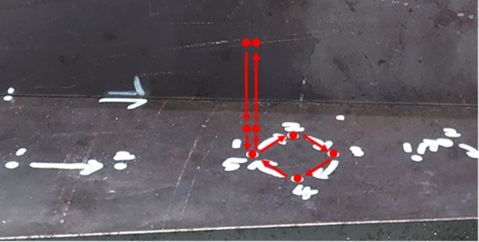
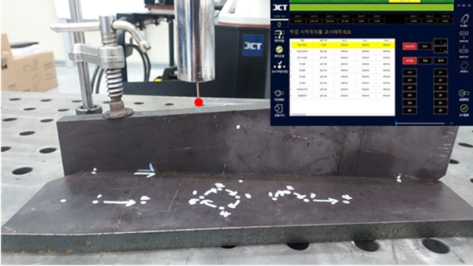
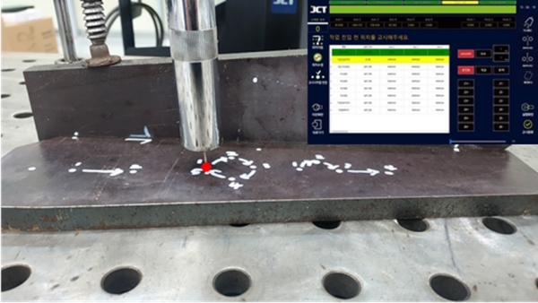
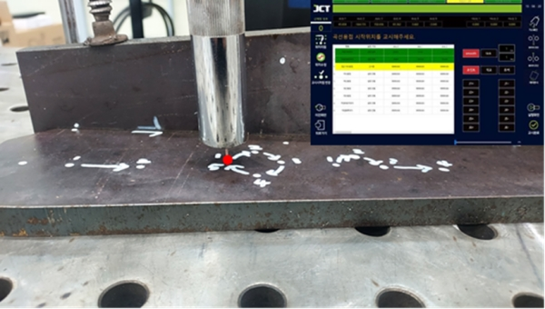
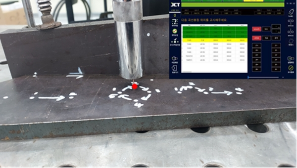
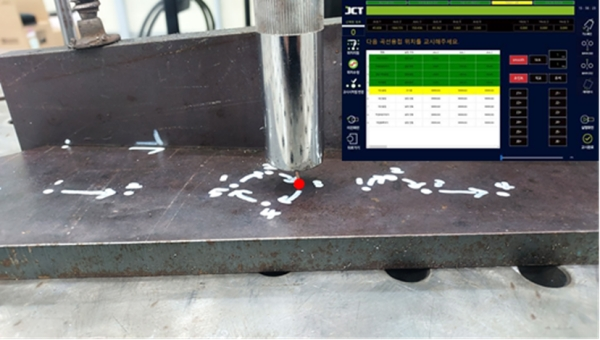
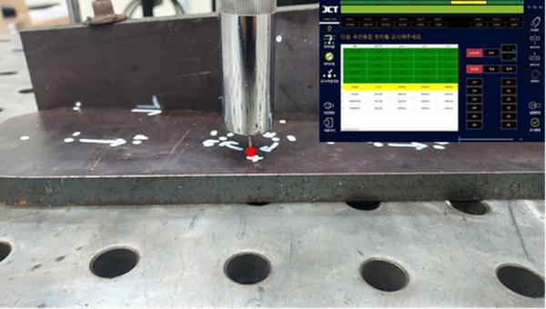
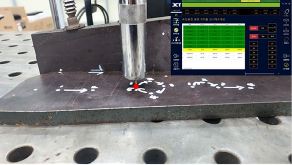
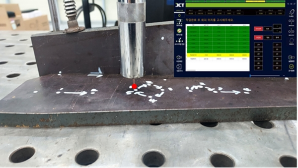
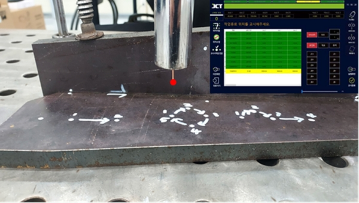

# 5.2.3 곡선용접

곡선 용접은 파이프나 곡선 등 직선이 아닌 곳을 용접할 때 사용됩니다.&#x20;

용접 중의 전류(A), 전압(V), 속도(mm/s), 용접의 시작과 종료 시점의 전류, 전압,  대기시간을 설정할 수 있습니다. 교시 화면에서는 용접 시작점, 중간점, 끝점의 3가지 포인트가 생성됩니다.&#x20;

연속으로 용접을 하는 경우는 2개씩 포인트가 추가됩니다.

<figure><figcaption></figcaption></figure>

#### ■  곡선용접 예시



곡선 용접을진행할 위치를 확인합니다.

<figure><figcaption></figcaption></figure>



메인 화면에서 "용접조건선택"을 클릭합니다.

<figure><figcaption></figcaption></figure>



곡선용접 > 용접조건 선택 >  추가 > 설정 완료를 실시합니다.

<figure><figcaption></figcaption></figure>



작업의 시작 위치를 교시합니다.

<figure><figcaption></figcaption></figure>



작업 진입 전 위치를 교시합니다.

<figure><figcaption></figcaption></figure>



곡선 용접의 시작 위치를 교시합니다.

<figure><figcaption></figcaption></figure>



다음 곡선 용접의 위치를 교시합니다.

<figure><figcaption></figcaption></figure>



다음 곡선 용접의 위치를 교시합니다.

<figure><figcaption></figcaption></figure>



다음 곡선 용접의 위치를 교시합니다.

<figure><figcaption></figcaption></figure>



곡선 용접의 종료 위치를 교시합니다.

<figure><figcaption></figcaption></figure>



작업 완료 후 회피 위치를 교시합니다.

<figure><figcaption></figcaption></figure>



작업 종료 위치의 교시합니다.

<figure><figcaption></figcaption></figure>



실행 버튼을 눌러 용접을 실시합니다.(모드 확인!)

<figure><figcaption></figcaption></figure>


