# 5.2.4 전환곡선용접

전환곡선용접은 곡선 구간 이후 직선으로 방향이 변경되거나 곡선의 방향이 바뀔 때 사용됩니다.&#x20;

용접중의 전류(A), 전압(V), 속도(mm/s), 용접의 개시와 종료 시점의 전류, 전압, IDLE 시간을 설정할 수 있습니다.

<figure>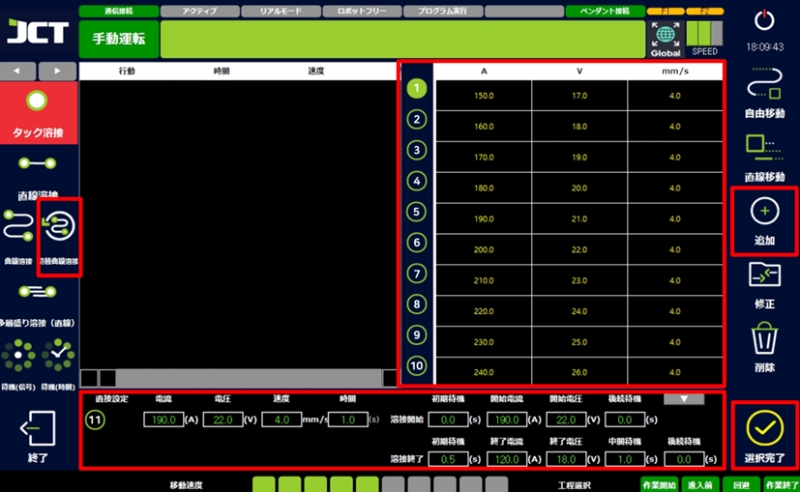<figcaption></figcaption></figure>

#### ■ 전환곡선용접 예시



전환 곡선 용접할 위치를 확인합니다.

<figure>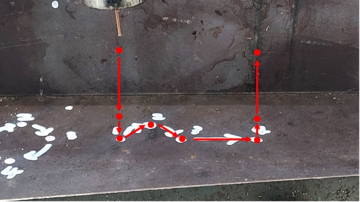<figcaption></figcaption></figure>



메인 화면에서 용접 선택을 클릭합니다.

<figure>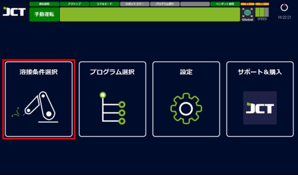<figcaption></figcaption></figure>



전환 곡선 용접 > 용접 조건 선택 >추가 > 설정 완료를 실시합니다.

<figure>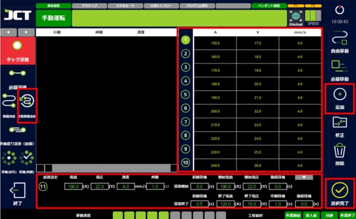<figcaption></figcaption></figure>



작업의 시작 위치를 교시합니다.

<figure>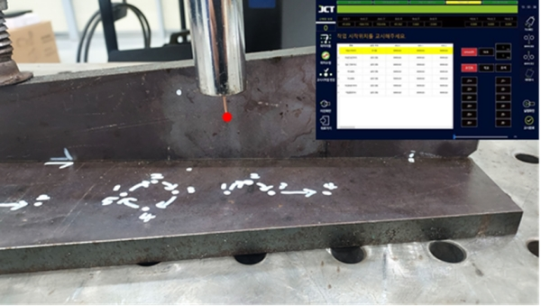<figcaption></figcaption></figure>



작업 진입 전 위치를 교시합니다.

<figure>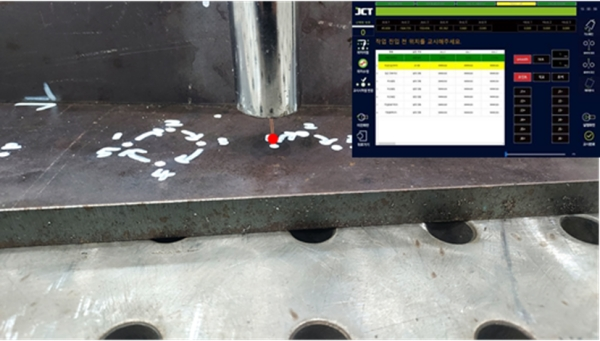<figcaption></figcaption></figure>



전환 곡선 용접 위치를 교시합니다.

<figure>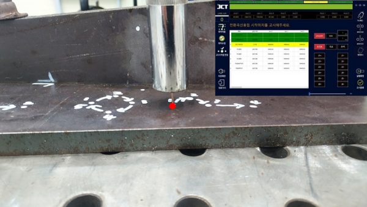<figcaption></figcaption></figure>



다음 전환 곡선 용접의 위치를 교시합니다.

<figure>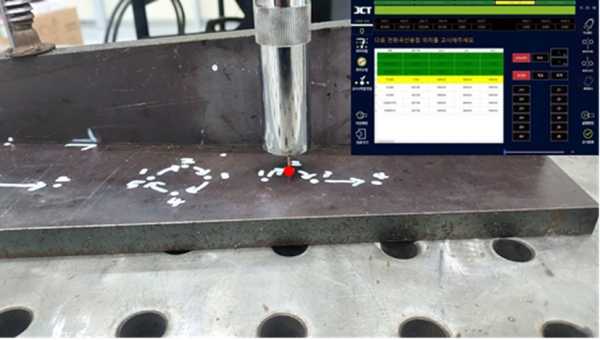<figcaption></figcaption></figure>



전환 곡선 용접의 종료 및 직선 용접의 시작 위치를 교시합니다.

<figure>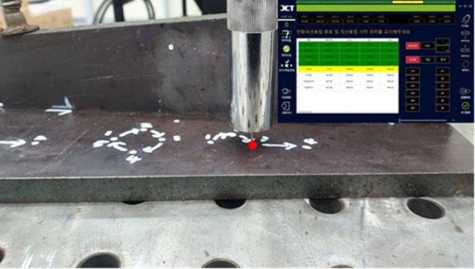<figcaption></figcaption></figure>



직선 용접의 종료 위치를 교시합니다.

<figure>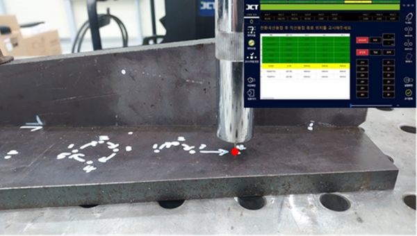<figcaption></figcaption></figure>



작업 완료 후 회피 위치를 교시합니다.

<figure>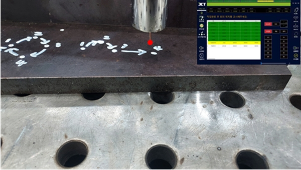<figcaption></figcaption></figure>



작업 종료 위치의 교시합니다.

<figure>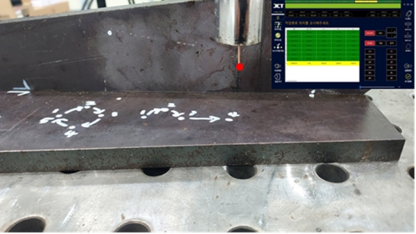<figcaption></figcaption></figure>



행 버튼을 눌러 용접을 실시합니다.(모드 확인!)

<figure>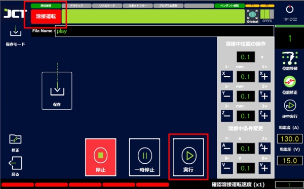<figcaption></figcaption></figure>


