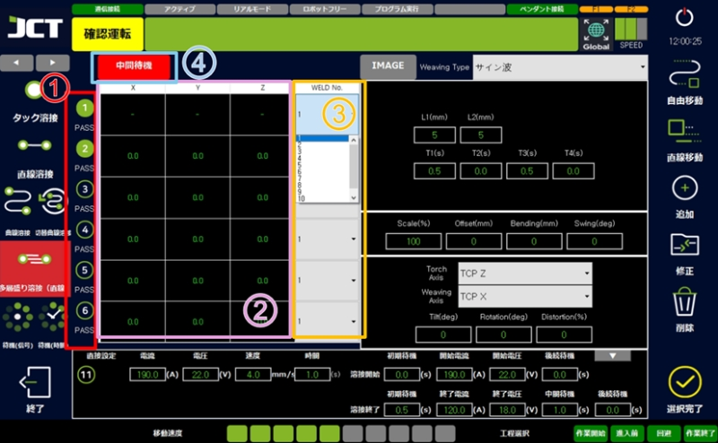

# 5.2.5 다중직선용접 (멀티레이어)

다중직선용접은 멀티 레이어 용접 방법 중 직선 용접을 할 때 사용됩니다.&#x20;

용접중의 전류(A), 전압(V), 속도(mm/s), 용접의 개시와 종료 시점의 전류, 전압, IDLE 시간을 설정할 수 있습니다.&#x20;

직선 용접과 동일한 방법으로 교시하고 시프트하는 횟수, X, Y, Z의 값으로 수행됩니다.

#### ■ 다중직선용접 예시

<figure><figcaption></figcaption></figure>

> 1. 작업 횟수를 설정합니다. 6회까지로 되어 있습니다.
> 2. 각 층의 시프트량을 설정합니다.
> 3. 각 층의 용접 조건을 선택합니다.
> 4. 한 층의 작업이 끝난 후 슬래그 제거나 비드 확인이 필요할 때 활성화하고 그 시간을 설정할 수 있습니다.
> 5. 직선 용접과 같은 방법으로 교시하여 용접을 실시합니다.
