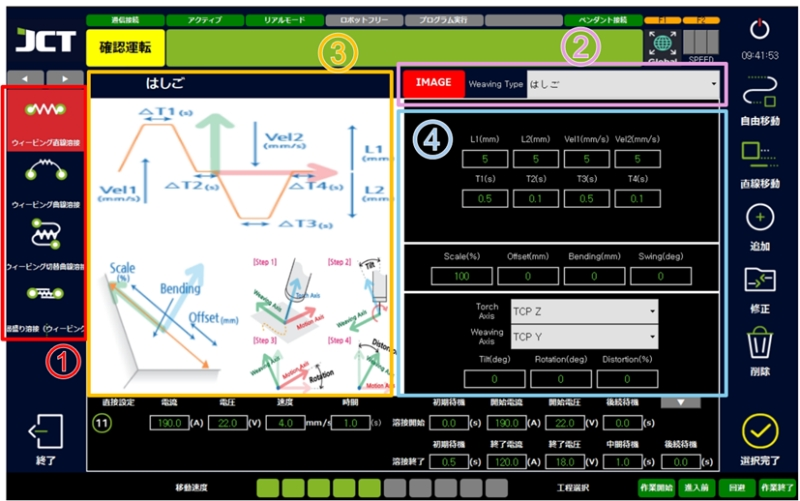
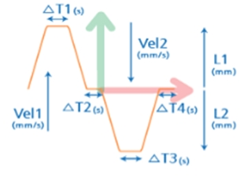
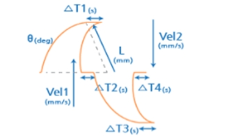
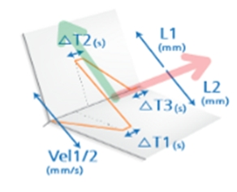
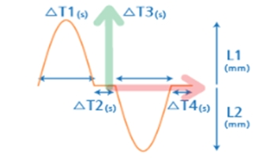
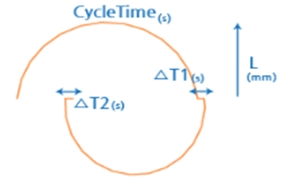
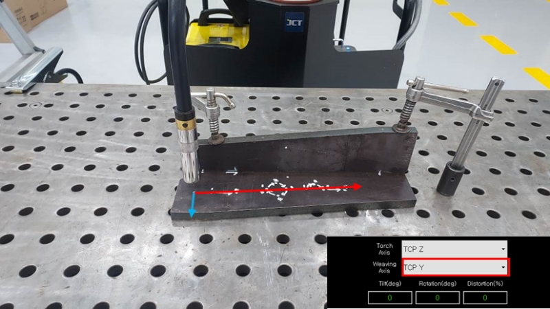
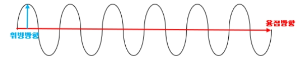
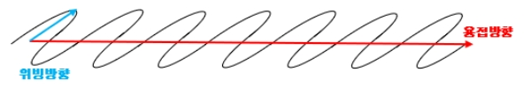

# 8.8. ウィービング溶接

ビング溶接は、設定されたTCPを基準にスウィングしながら溶接する機能です。
ウィービング溶接の種類としてはウィービング直線溶接、ウィービング曲線運転、
ウィービング転換曲線運転、多重ウィービング直線溶接があり、教示方法は前の7.4.\~7.7.までの
一般溶接動作と同じです。

#### ■ ウィービング溶接条件設定画面

<figure><figcaption></figcaption></figure>

> *   ウィービングモード選択
>
>     ウィービング溶接の動作を選択します。
>
> *   ウィービング方式選択
>
>     ウィービング方式を選択するウィンドウであり、
>
>     選択変更時の参考イメージと変更数値リストが変わります。
>     はしご、サイン波、三角、半円、円などがあります。
>
> *   ウィービング参考画像
>
>     選択されているウィービング方式の参考イメージと名前を表示する機能です。
>     アイコンを押すと参考イメージを表示し、もう一度押すと解除されます。
>
> *   ウィービング条件設定
>
>     ウィービングの長さ、幅、区間到達時間などウィービングに必要な数値を調節するウィンドウであり、方式によってウィンドウに修正リストが変更されます。

***

#### ■ 各ウィービングの参考イメージ

|                       |                       |
| --------------------- | --------------------- |
| ▶ はしご                 | ▶ 半円                  |
|  |  |
| ▶ 三角                  |                       |
|  |                       |
| L1(mm) : ↑方向幅         | ΔT1(s) : ΔT1位置での時間    |
| L2(mm) : ↓方向幅         | ΔT2(s) : ΔT2位置での時間    |
| Vel1(mm/s) : L1 速度    | ΔT3(s) : ΔT3 位置での時間   |
| Vel2(mm/s) : L2 速度    | ΔT4(s) : ΔT4 位置での時間   |
| θ(deg) :円弧の角度         | 時間によって長くなります。         |
| 速すぎると衝突の恐れがあります。      | 不要な時は０に設定。            |

|                        |                       |
| ---------------------- | --------------------- |
| ▶ サイン派                 | ▶ 円                   |
|   |  |
| L1(mm) : ↑方向幅          | ΔT1(s) : ΔT1位置での時間    |
| L2(mm) : ↓方向幅          | ΔT2(s) : ΔT2位置での時間    |
| L(mm) : 円の半径           | ΔT3(s) : ΔT3 位置での時間   |
| CycleTime(s) : 円の1周の時間 | ΔT4(s) : ΔT4 位置での時間   |

***

#### ■ ウィービング溶接を行う時には進行方向に注意

<figure><figcaption></figcaption></figure>

> * Torch Axisの修正は必要はありませんが、Weaving Axisは溶接進行方向と異なるように設定しなければなりません。
> * 溶接方向がX軸方向であれば、溶接進行方向はY軸に設定する必要があり、トーチの角度は溶接開始と終了が同じでなければなりません。
> * 溶接進行方向とウィービング方向が同じか、トーチの角度が同じでない場合は、ウィービングの波形が傾いたり形成されないことがあります

***

#### ■ 正しいウィービング例（サイン派）

<figure><figcaption></figcaption></figure>

#### ■ 正しくないウィービング例（サイン派）

<figure><figcaption></figcaption></figure>
