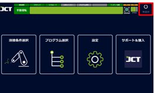
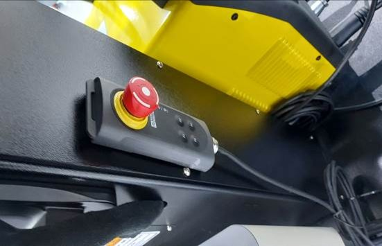
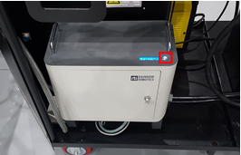
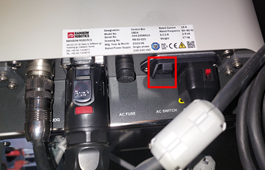

# 5.2. ロボット

*   教示ボタン\

    
<figure><figcaption></figcaption></figure>

    ロボットを位置を記録する教示ボタンとして使用します。

*   緊急停止ボタン\

    
<figure><figcaption></figcaption></figure>

    ロボット緊急停止ボタン、押すとロボットのパワーが遮断されます。

*   ロボット電源スイッチ\

    
<figure><figcaption></figcaption></figure>

    
<figure><figcaption></figcaption></figure>

    コントローラの電源と制御電源はキースイッチで制御され、通常使用時には触れません。

    必要な状況以外の作業はお勧めできません

