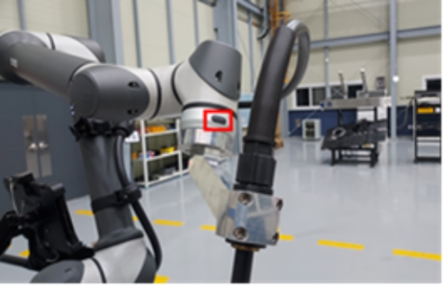
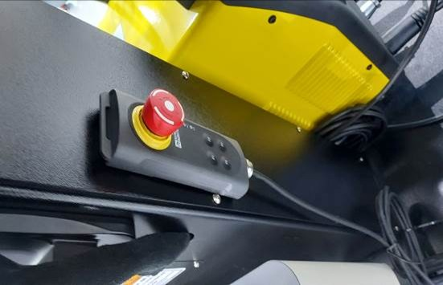
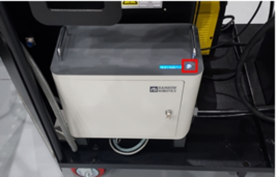
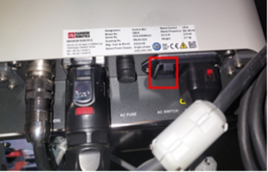

# 5.2. ロボット

#### ■ 教示ボタン

<figure><figcaption></figcaption></figure>

ロボットを位置を記録する教示ボタンとして使用します。

#### ■ 緊急停止ボタン

<figure><figcaption></figcaption></figure>

ロボット緊急停止ボタン、押すとロボットのパワーが遮断されます。

#### ■ ロボット電源スイッチ

|                                                                     |                                                                     |
| :-----------------------------------------------------------------: | :-----------------------------------------------------------------: |
|  |  |

コントローラの電源と制御電源はキースイッチで制御され、通常使用時には触れません。

必要な状況以外の作業はお勧めできません
