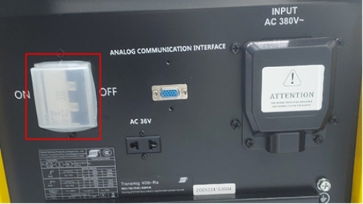
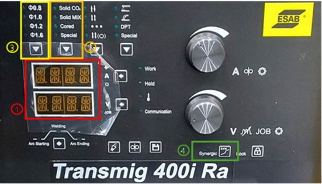

# 5.3. 溶接機

#### ■ 溶接機電源スイッチ

<figure><figcaption></figcaption></figure>

溶接機の電源を ON/OFF します。溶接機の裏側にあります。

> 制御電源から切り離されており、メーカーによって位置が異なる場合があります。
>
> メーカーによっては入力電源が異なる場合があります。
>
> 接地を接続しないと、溶接機の安全性と溶接品質に影響を与える可能性があります。

#### ■ 溶接機操作パネル

<figure><figcaption></figcaption></figure>

溶接機の独自の設定を変更するパネルです。\
ワイヤ、ガスなどの可溶火災が変わったり、短絡/パルスモードに切り替えるときに操作します。

> *   ディスプレイパネル\
>     溶接中の電圧/電流値を表示します。
>
>     （溶接中でないときは指令受けた値を表示します。）
> * 溶接選択\
>   溶接方法、ガスの種類を設定します。
> * ワイヤ溶接方法、ガスの種類を設定します。ーサイズ設定\
>   使用するワイヤーのサイズを設定します。
> *   シナジック溶接\
>     シナジック機能を使用できます。
>
>     （設定したらランプが点灯します。）


上の写真はESAB溶接機に基づいて説明されており、溶接機によって機能と動作方法が異なります。\
詳細については、溶接機のマニュアルを参照してください。

