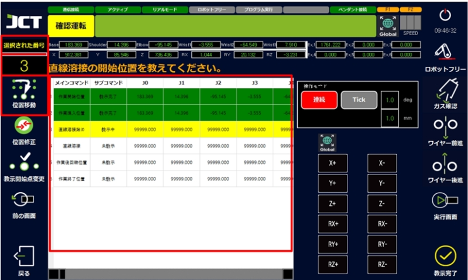
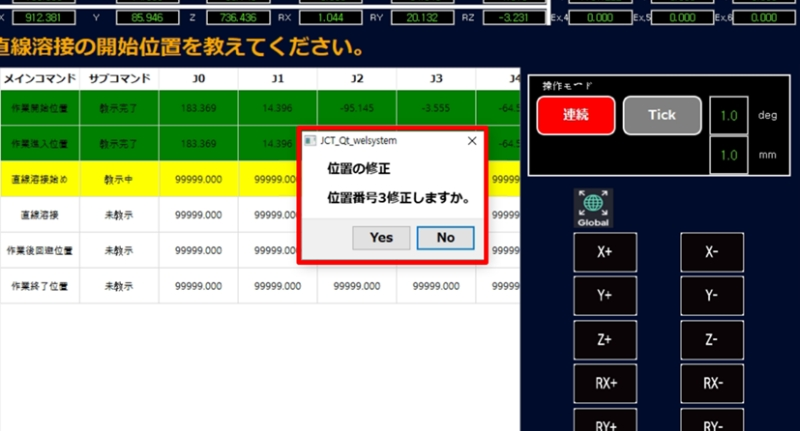
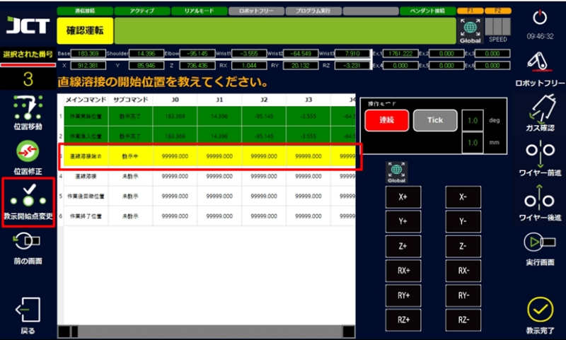
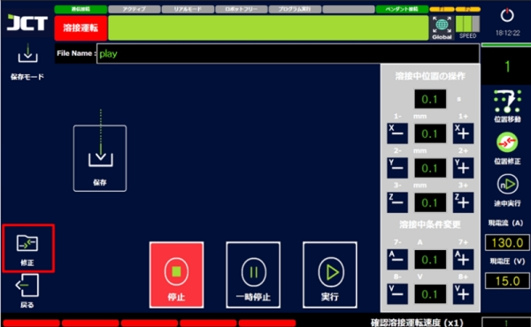
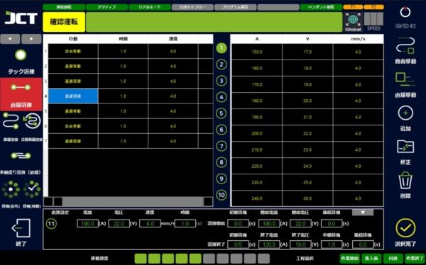
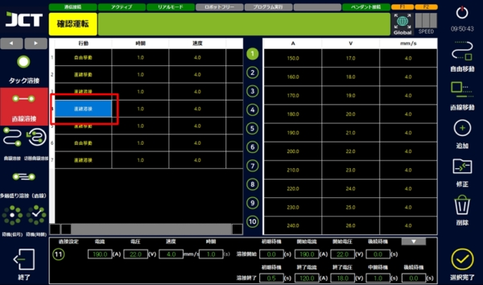
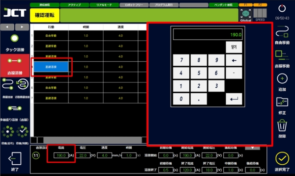
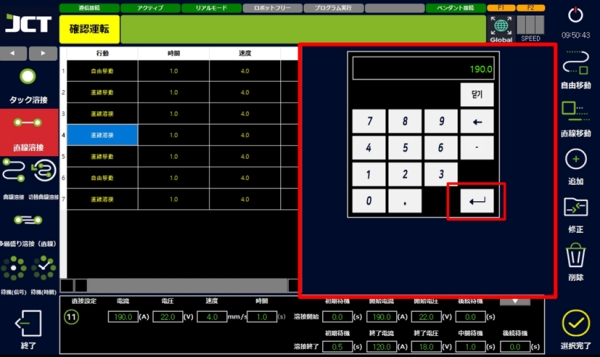
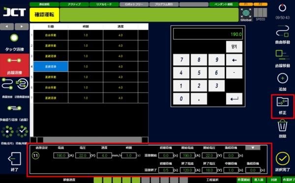
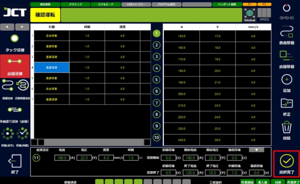

# 5.3 프로그램 수정

#### ■ 위치 이동

교시되어 있는 위치로 로봇을 이동시키는 기능입니다.&#x20;

교시 위치 확인, 중도 실행을 위한 이동 시 사용합니다.&#x20;

위치이동 버튼을 누르는 동안 움직이므로 안전 관련 주의가 필요하며 손을 놓는 순간 정지합니다.&#x20;

(실행화면에서의 사용도 가능합니다.)

<figure><figcaption></figcaption></figure>



이동할 위치를 선택합니다.



번호 확인 후 위치 이동 버튼을 누릅니다.



위치가 변경되면 빨간 선이 녹색으로 바뀝니다.



교시가 완료되면 '실행화면' 버튼을 눌러 실행화면으로 돌아갑니다.



***

#### ■ 위치 수정

선택된 번호의 위치에 현재 로봇의 위치를 덮어쓰고 수정합니다. (실행화면에서의 사용도 가능합니다.)

<figure><figcaption></figcaption></figure>



수정할 위치를 선택합니다.



번호 확인 후 위치 수정 버튼을 누릅니다.



다시 확인 메시지를 확인합니다.



위치가 변경되면 빨간 선이 녹색으로 바뀝니다.



교시가 완료되면 '실행화면' 버튼을 눌러 실행화면으로 돌아갑니다.



***

#### ■ 교시 시작점 변경

어떤 위치에서 연속으로 위치를 변경할 경우 변경 시작 위치를 선택하여 수정해 나갈 수 있습니다.

<figure><figcaption></figcaption></figure>



수정을 시작할 위치를 선택합니다.



번호 확인 후 교시 시작점 변경 버튼을 누릅니다.



변경 구간을 연속으로 교시합니다.



교시가 완료되면 '실행화면' 버튼을 눌러 실행화면으로 돌아갑니다.



***

#### ■ 용접 조건 수정



실행 화면의 왼쪽 하단 수정 버튼을 누릅니다.

<figure><figcaption></figcaption></figure>



프로그램 작성 화면으로 돌아갑니다.

<figure><figcaption></figcaption></figure>



수정이 필요한 위치를 선택합니다.

<figure><figcaption></figcaption></figure>



변경을 원하는 조건의 숫자를 더블 터치하고 키패드를 엽니다.

<figure><figcaption></figcaption></figure>



변경할 숫자를 입력한 후 엔터를 누릅니다.

<figure><figcaption></figcaption></figure>



수정 버튼을 눌러 조건이 변경되었는지 확인합니다.

<figure><figcaption></figcaption></figure>



설정 완료를 눌러 변경을 종료합니다.

<figure><figcaption></figcaption></figure>


