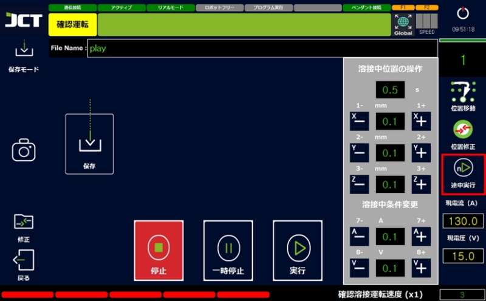
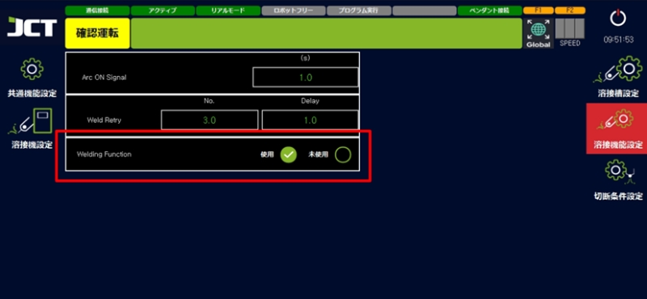
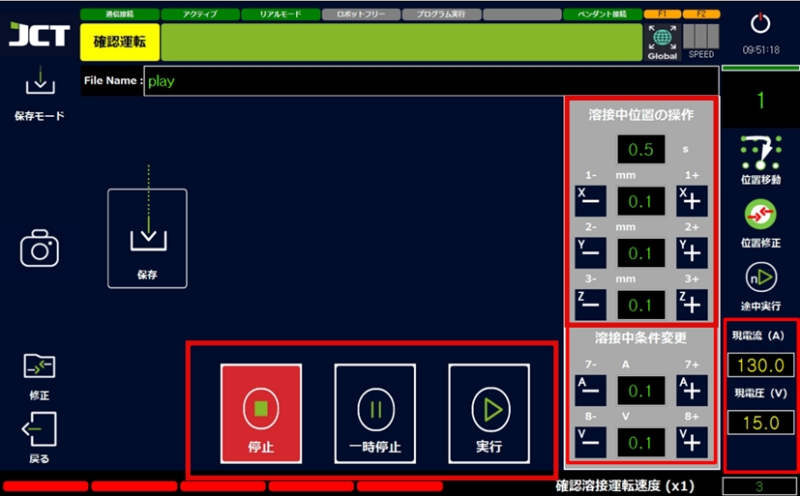

# 5.4 실행 모드 설명

#### ■ 확인 운전

작성된 용접 프로그램을 용접하지 않고 수행하는 모드입니다.&#x20;

용접 프로그램의 교시 위치, 토치의 각도, 동작중의 충돌 유무등을 확인할 수 있습니다.&#x20;

(실행 화면의 '확인 용접 운전 속도(x1)'를 조절하여 속도를 바꿀 수 있습니다.)&#x20;

펜던트의 셀렉트 스위치를 가운데에 두면 확인 운전 모드가 됩니다.&#x20;

터치 화면으로 변경도 가능합니다.

***

#### ■ 용접 운전

작성된 용접 프로그램을 실제 용접을 실행하는 모드입니다.&#x20;

확인 운전 중 셀렉트 스위치를 용접 운전으로 바꾸면 바로 용접을 실시하므로 주의가 필요합니다.&#x20;

이 기능을 응용하여 작성된 용접 프로그램에서 원하는 부분만 용접하는 것도 가능해집니다.

***

#### ■ 수동 운전

용접 프로그램의 실행이 불가능하게 되어, 실수에 의한 기동을 막을 수 있습니다.&#x20;

펜던트의 키패드나 화면의 버튼으로 로봇 조작은 가능합니다.

<figure><figcaption></figcaption></figure>

***

#### ■ 중도실행

용접 프로그램을 원하는 포인트부터 실행할 수 있습니다.&#x20;

원하는 모션번호로 변경하고 위치를 이동시킨 후 중간 실행 버튼을 눌러주세요.

입력한 위치에서 작업이 시작됩니다.

<figure><figcaption></figcaption></figure>

***

#### ■ 용접 중 조건 및 위치조작

용접 중 실시간으로 용접 위치를 움직이거나 전류나 전압을 확인하면서 조건을 변경할 수 있습니다.

<figure><figcaption></figcaption></figure>

***

#### ■ 조작 패널 설명

<figure><figcaption></figcaption></figure>

> *   용접 위치 조작
>
>     용접 중, 로봇을 움직여 용접 포인트의 조작을 할 수 있습니다.
>
>     입력한 거리씩 이동할 수 있습니다.
>
>     (펜던트의 1,2,3 버튼의 +, -에서도 조작 가능)
> *   용접 중 조건 변경
>
>     용접 중 용접 전류 및 전압을 조정할 수 있습니다.
>
>     입력한 수치씩 +, -조정이 가능합니다.
>
>     (펜던트의 7, 8 버튼의 +, -로 조정 가능)
> * 현재의 전류, 전압을 확인할 수 있습니다.
> *   일시정지\
>     프로그램 실행 중 작업을 일시적으로 중지하고 싶을 때 사용하는 기능입니다.
>
>     용접 중이라면 용접도 일시 정지하고 실행 버튼을 누를 때까지 정지를 유지합니다.
> * 실행\
>   버튼을 누르면 용접도 계속 진행하기 때문에 주의가 필요합니다.
> *   정지\
>     실행 중인 용접 프로그램을 즉시 정지하고 작업을 완료로 처리합니다.
>
>     용접을 실시하는 중이라도 정지합니다.
