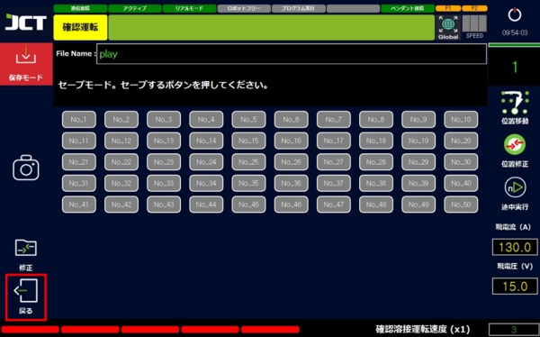

# 5.5.1 프로그램 저장

#### ■ 직접 저장



파일명란을 선택합니다.

<figure><figcaption></figcaption></figure>



이름을 입력하고 키패드를 닫습니다.

<figure><figcaption></figcaption></figure>



저장을 누릅니다.

<figure><figcaption></figcaption></figure>



경로를 지정하고 저장하여 완료합니다.

<figure><figcaption></figcaption></figure>



***

#### ■ 저장 모드 사용



왼쪽 상단의 저장 모드를 누릅니다.

<figure><figcaption></figcaption></figure>



저장할 번호를 선택하십시오.

<figure><figcaption></figcaption></figure>



확인 메시지에서 YES를 선택합니다.

<figure><figcaption></figcaption></figure>



저장이 완료됩니다.「돌아가기」버튼으로 이전의 화면으로 돌아옵니다.

<figure><figcaption></figcaption></figure>


