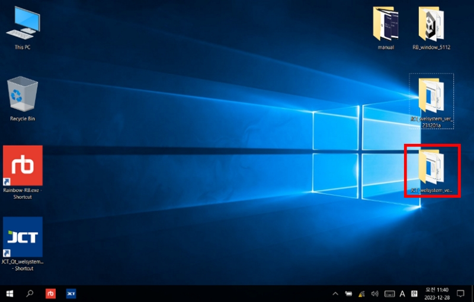
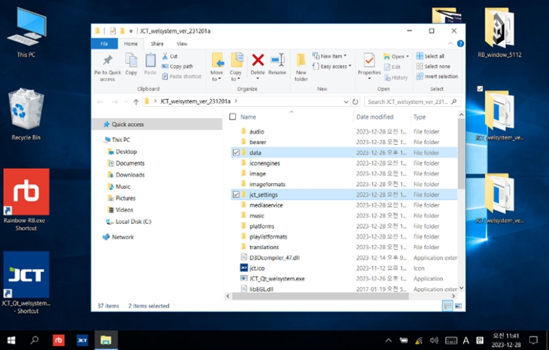
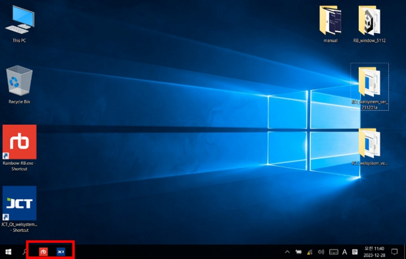

# 6. 소프트웨어 업데이트



새로운 버전의 소프트웨어를 다운로드합니다.

다운로드경로：\
[https://drive.google.com/drive/folders/1IcrHojQlRCAE2-r2JXp4gEEtEx9RXKiL?usp=sharing](https://drive.google.com/drive/folders/1IcrHojQlRCAE2-r2JXp4gEEtEx9RXKiL?usp=sharing)



새 버전의 소프트웨어를 데스크톱에 복사합니다.

<figure><figcaption></figcaption></figure>



원래 있던 폴더로부터, 폴더를 신규 버전의 폴더로 카피합니다.(덧글 쓰겠습니다.)

<figure><figcaption></figcaption></figure>



바탕화면 바로가기 위에서 우클릭하여 로 들어가 신규 버전의 경로로 프로그램 파일의 경리를 변경합니다.

<figure><figcaption></figcaption></figure>



작업 표시줄의 샷을 삭제하고 수정한 바로 가기를 교체합니다.

<figure><figcaption></figcaption></figure>



변경 작업이 끝나면 기존 폴더를 삭제합니다.

<figure><figcaption></figcaption></figure>


