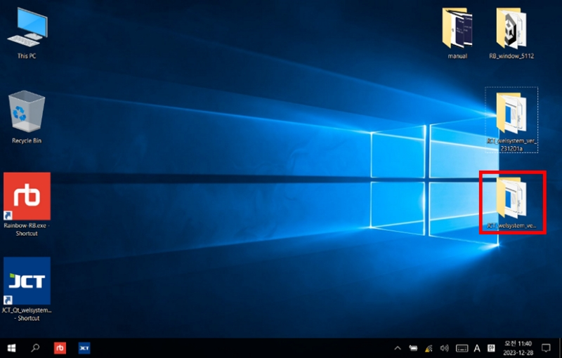
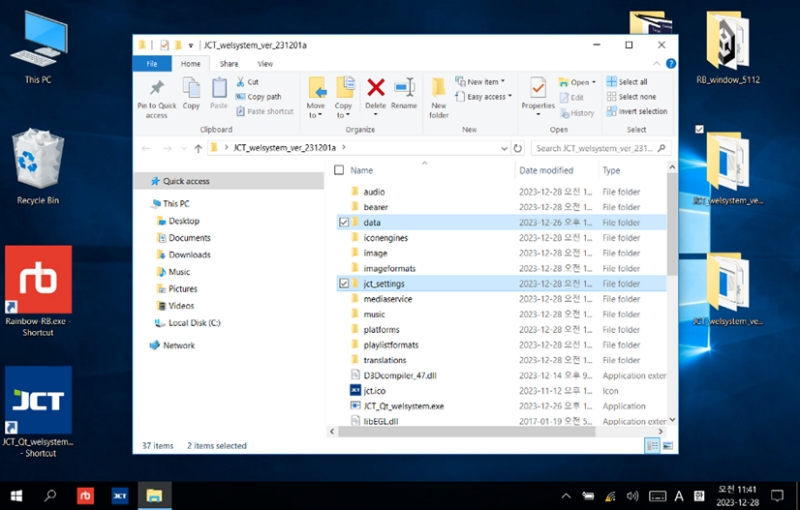
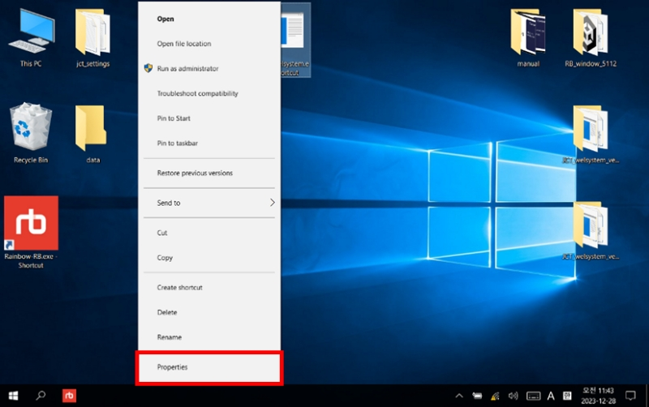
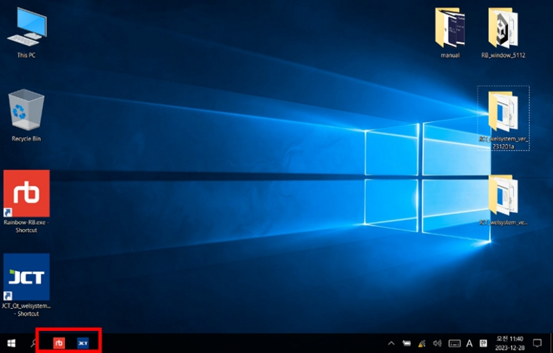

# 6. ソフトウェアのアップデータ



新しいバージョンのソフトウェアをダウンロードします。

ダウンロード経路：

[https://drive.google.com/drive/folders/1IcrHojQlRCAE2-r2JXp4gEEtEx9RXKiL?usp=sharing](https://drive.google.com/drive/folders/1IcrHojQlRCAE2-r2JXp4gEEtEx9RXKiL?usp=sharing)



新しいバージョンのソフトウェアをデスクトップへコピーします。

<figure><figcaption></figcaption></figure>



元にあったフォルダーから、フォルダーを新規バージョンのフォルダーへコピーします。（上書きします。）

<figure><figcaption></figcaption></figure>



デスクトップのショートカットの上から右クリックして、＜Properties＞へ入り新規バージョンの経路へとプログラムファイルーの経理を変更します。

<figure><figcaption></figcaption></figure>



タスクバーのショットを削除して修正したショートカットを入れ替えます。

<figure><figcaption></figcaption></figure>



変更作業が終わったら既存のフォルダーを削除します。

<figure><figcaption></figcaption></figure>


