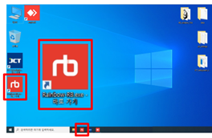
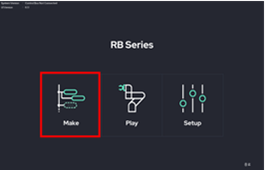
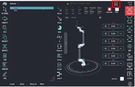
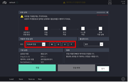
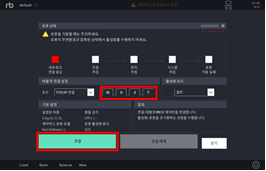
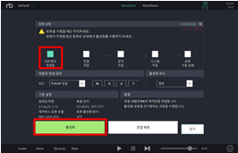
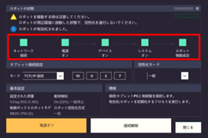
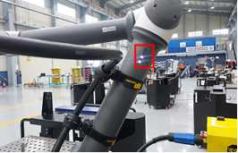
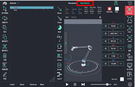
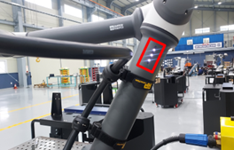

# 6.1. ロボット活性化

RB プログラムを使用するにはロボットの活性化が必要です。

1.  デスクトップでRBアイコンを起動します。\

    
<figure><figcaption></figcaption></figure>

2.  MAKEボタンを押します。\

    
<figure><figcaption></figcaption></figure>

3.  右上の通信ボタンを押します。\

    
<figure><figcaption></figcaption></figure>

4.  接続設定でTCP / IP接続を選択します。\

    
<figure><figcaption></figcaption></figure>

5.  IPを入力し、下の接続ボタンを押します。\
    初期設定IPは「10.0.2.7」です。\

    
<figure><figcaption></figcaption></figure>

6.  接続が完了したら、活性化ボタンを押します。\

    
<figure><figcaption></figcaption></figure>

7.  起動が始まり、四角の中のすべてのランプが点灯するまで待ちます。\
    起動が完了すると、ロボット側面のLEDが2つ点灯します。\

    
<figure><figcaption></figcaption></figure>

    
<figure><figcaption></figcaption></figure>

8.  MAKE画面に戻りReal Robotモードに変更すると、ロボット側面のLEDが3つ点灯します。

    ロボットの活性化が完了します。シミュレーションモードでは、実際のロボットは動作しません。\
    \
    \

    
<figure><figcaption></figcaption></figure>

