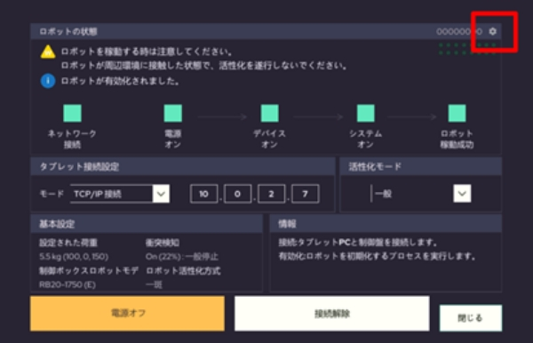
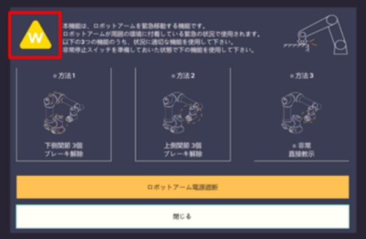
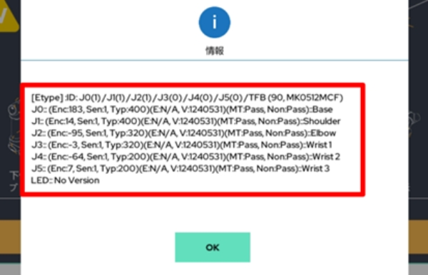
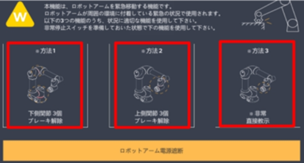
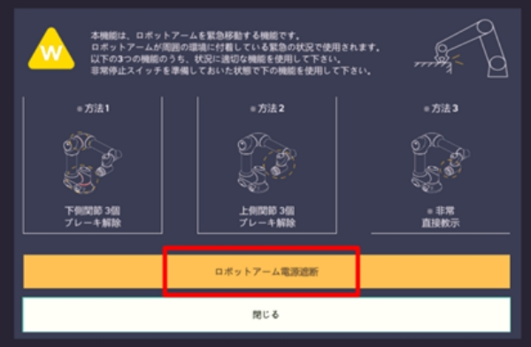
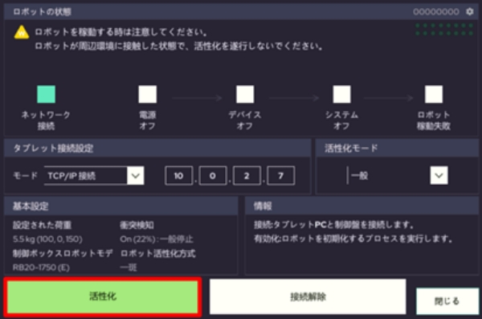

# 6.4. ロボット関節の手動解放

RainbowRobotics ロボットの各関節は-360から+360まで動くことができますが、\
オペレータにより強制的にその限界を超えてしまう場合があります。\
関節を動かすとアラームが発生し、その状態では起動できなくなります。\
これに対する対処方法です。



通信接続画面で右上の設定アイコンを押します。

<figure><figcaption></figcaption></figure>



左側の三角形のアイコンをクリックします。

<figure><figcaption></figcaption></figure>



ロボット各関節の角度を確認します。

<figure><figcaption></figcaption></figure>



該当する関節のブレーキを解除します。

<figure><figcaption></figcaption></figure>



手で関節の角度を修正します。




該当する関節が360以内に位置してから電源を切断します。

<figure><figcaption></figcaption></figure>



活性化を進めます。

<figure><figcaption></figcaption></figure>


