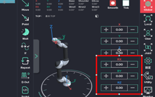
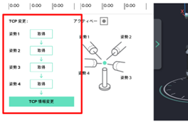

# 8.1. 教示方法

教示ボタンを押して、ロボットの現在座標をプログラムの該当の場所に保存できます。

<figure><figcaption>
&#x3C;ロボットの直接教示ボタン>
</figcaption></figure>

<figure><figcaption>
&#x3C;ペンダントの教示ボタン>
</figcaption></figure>


**正しい教示方法**

チップの端から溶接ワイヤを15mmほど露出させた後、ワイヤの端点を溶接を希望する位置に合わせて教示を行ってください。


***

#### ■ 直接教示

ロボットフリー機能を活性化させ、ロボットを手動で教示する位置に移動させた後、\
直接教示ボタンを押して位置を保存（教示）します。\
（位置を修正する場合は、ペンダントの「戻る」で教示を取り消すことができます。）

***

#### ■ ペンダント教示

ティーチングペンダントの右にあるボタンを操作して教示位置に移動する方法であり、操作方法には「Joint」、「Global」、「Local」の3つがあります。

<figure><figcaption>
＜ティーチングペンダントの手動操作ボタン＞
</figcaption></figure>

* F1（座標系切替ボタン）：ボタンを押すと座標系を切替します。

<table><thead><tr><th width="66"></th><th width="197"></th><th></th></tr></thead><tbody><tr><td></td><td>関節座標系</td><td>ロボットの各関節を動かす座標系</td></tr><tr><td></td><td>グローバル座標系</td><td>ロボット中心を基準に横、縦、垂直に動く座標系</td></tr><tr><td></td><td>ツール座標系</td><td>ロボットTCPを基準に横、縦に垂直に動く座標系</td></tr></tbody></table>

* F2（手動速度切替ボタン)：ボタンを押すと3つの速度に切替します。

<table><thead><tr><th width="66"></th><th width="197"></th><th></th></tr></thead><tbody><tr><td></td><td>低速</td><td>基本速度 10%</td></tr><tr><td></td><td>中速</td><td>基本速度40%</td></tr><tr><td></td><td>高速</td><td>基本速度70%</td></tr></tbody></table>


環境設定で速度変更が可能です。


* 1± \~ 3± / X± \~ Z± （手動操作ボタン1）\
  （溶接プログラム動作中の溶接中の位置操作機能にも使用されます。）

<table><thead><tr><th width="66"></th><th width="197"></th><th></th></tr></thead><tbody><tr><td></td><td>低関節座標系</td><td>J1・J2・J3関節を±方向に制御します。</td></tr><tr><td></td><td>グローバル座標系</td><td>直交X・Y・Zを±方向に制御します。</td></tr><tr><td></td><td>ツール座標系</td><td>トーチの先端を基準に、X・Y・Zを±方向に制御します。</td></tr></tbody></table>

* 4± \~ 6± / RX± \~ RZ± （ 手動操作ボタン２）

<table><thead><tr><th width="66"></th><th width="197"></th><th></th></tr></thead><tbody><tr><td></td><td>関節座標系</td><td>J4・J5・J6関節を±方向に 回転します。</td></tr><tr><td></td><td>グローバル座標系</td><td>直交RX・RY・RZを±方向に回転します。</td></tr><tr><td></td><td>ツール座標系</td><td>トーチの先端を基準にRX・RY・RZを±方向に回転します。</td></tr></tbody></table>

*   EX 1± \~ 2±（付加軸手動操作ボタン）\
    付加軸1±\~2±に対する手動操作ボタン（付加軸を適用したときに有効です。）

    溶接プログラム動作中の場合、溶接中の条件変更機能にも使用されます。

<figure><figcaption>
&#x3C; 座標系参考 >
</figcaption></figure>
