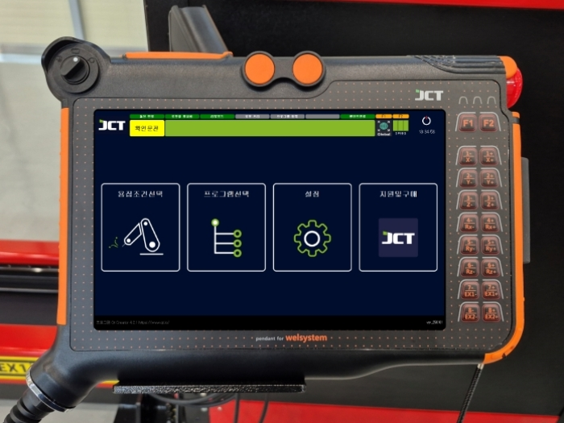

# 8.5. 曲線溶接

曲線溶接は、パイプやカーブなど直線ではないところを溶接するときに使用します。\
溶接中の電流(A)・電圧(V)・速度(mm/s)、溶接の開始と終了時点の電流・電圧・IDLE時間を\
設定することができます。教示画面では、溶接開始点と終点の 3つのポイントが生成されます。\
連続で溶接を行う場合は2つずつポイントが追加されます。

<figure><figcaption></figcaption></figure>

#### ■ 曲線溶接例



曲線溶接するポイントを設定します。

<figure><figcaption></figcaption></figure>



メイン画面で溶接選択をクリックします。

<figure><figcaption></figcaption></figure>



曲線溶接 > 溶接条件選択 > 追加 > 設定完了を行います。

<figure><figcaption></figcaption></figure>



作業の開始位置を教示します。

<figure><figcaption></figcaption></figure>



作業進入前の位置を教示します。

<figure><figcaption></figcaption></figure>



曲線溶接の開始位置を教示します。

<figure><figcaption></figcaption></figure>



次の曲線溶接の位置を教示します。

<figure><figcaption></figcaption></figure>



次の曲線溶接の位置を教示します。

<figure><figcaption></figcaption></figure>



次の曲線溶接の位置を教示します。

<figure><figcaption></figcaption></figure>



曲線溶接の終了位置を教示します。

<figure><figcaption></figcaption></figure>



作業完了後、回避位置を教示します。

<figure><figcaption></figcaption></figure>



作業終了位置の教示します。

<figure><figcaption></figcaption></figure>



実行ボタンを押して溶接を行います。（モードの確認！）

<figure><figcaption></figcaption></figure>


