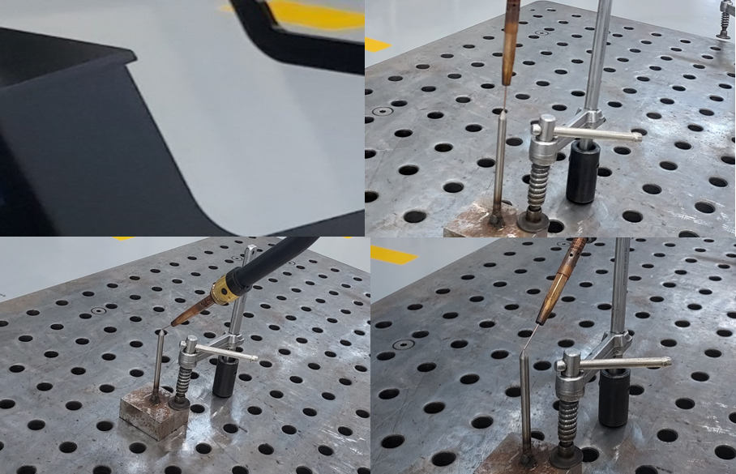

# 8.9. 待機

待機とは動作との間にIDLE時間を追加する機能です。指令待機と時間待機があります。\
教示画面では１つのポイントが生成されます。

#### ■ 指令待機

#### 待機位置に移動後、解除ボタンを押すまで作業を遅延できる機能です。

<figure><figcaption></figcaption></figure>

***

#### ■ 時間待機

待機位置に移動後、設定の時間まで作業を遅延できる機能です。

<figure><figcaption></figcaption></figure>
