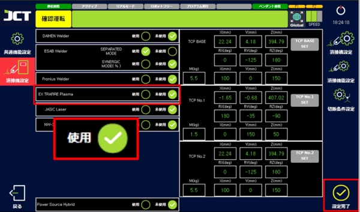
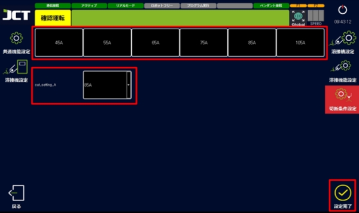
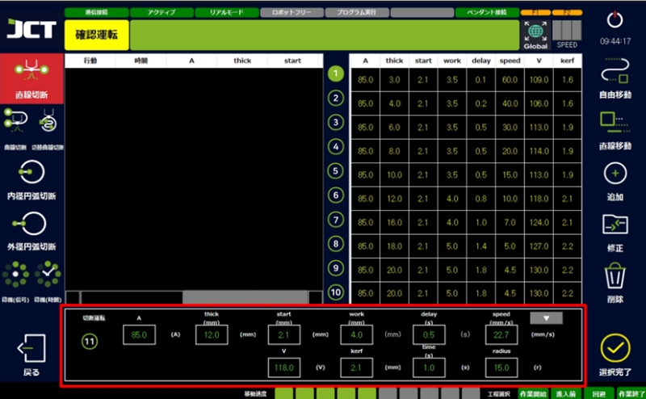

# 9.1. プラズマ使用有効化



設定ページの溶接機設定からプラズマ装備をチェックして設定完了を押します。

<figure><figcaption></figcaption></figure>



切断条件設定から切断出力を選択します。

<figure><figcaption></figcaption></figure>



***

#### ■ 切断条件の説明

<figure><figcaption></figcaption></figure>

> * A : 切断指令電流
> * Thick(mm) : 素材の厚さ。（参考用であり切断には影響ありません。）
> * Start(mm) : 切断開始の時、素材とノズルの間の距離
> * Work(mm) : 切断中の時、素材とノズルの間の距離
> * Delay(s) : 切断が開始して動き始まるまでのIDLE時間
> * Speed(mm/s) : 切断速度
> * V : 切断指令電圧
> * Kerf(mm) : 切断により除去される素材の幅
> * Time(s) : 切断完了後、プラズマOFFまでのIDLE時間
> * Radius(r) : 円弧切断の際、円弧の半径
