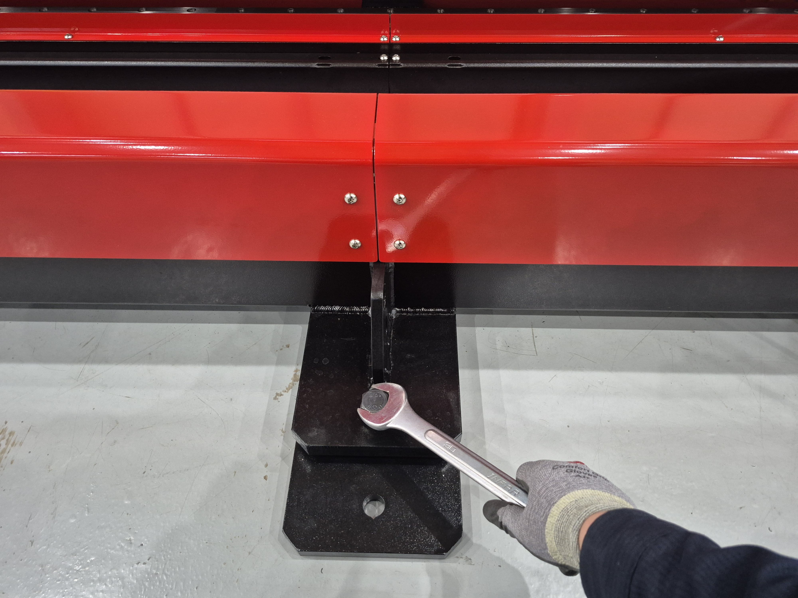

# 2.2.1 프레임 설치



제품을 원하는 위치로 이동시킵니다.

<figure><figcaption></figcaption></figure>



레벨 패드를 내려 단단히 고정시킵니다.

<figure><figcaption></figcaption></figure>



측정장비를 이용하여 평형을 맟춥니다.

<figure><figcaption></figcaption></figure>



용접정반 또는 용접 대상에 어스를 연결합니다.

<figure><figcaption></figcaption></figure>


