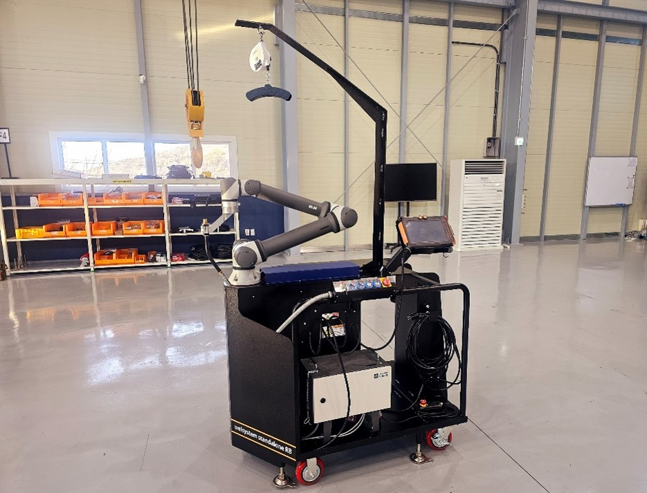
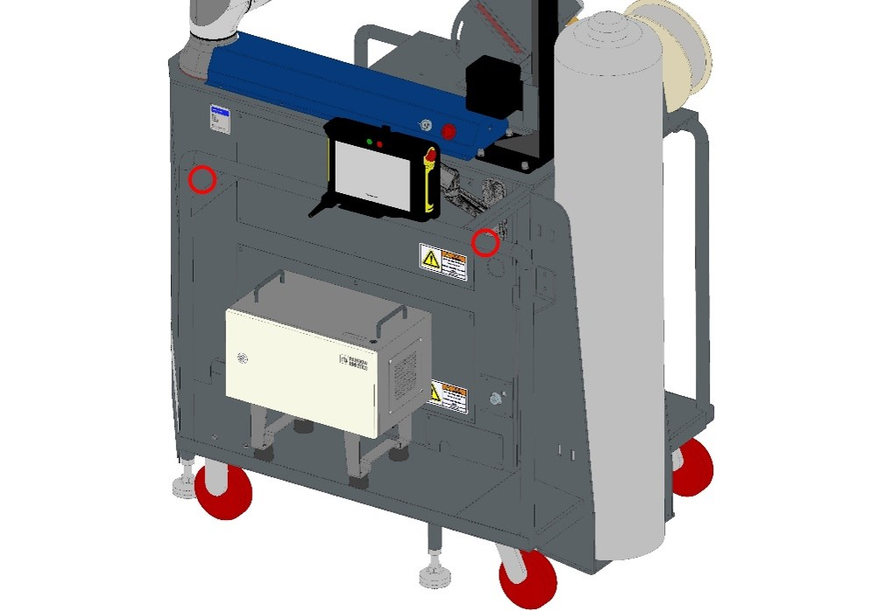
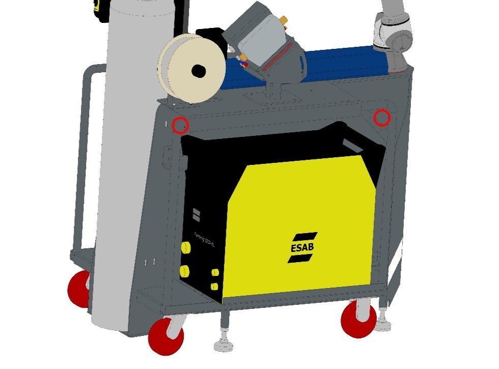
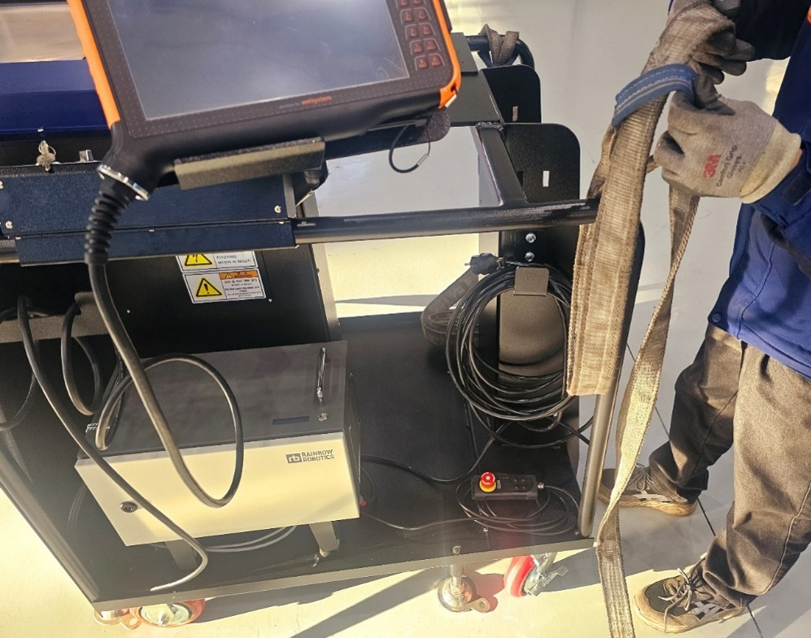
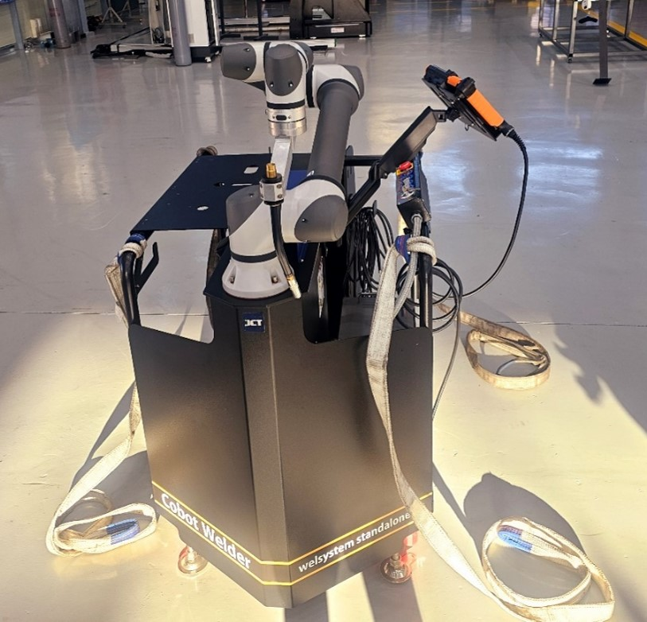
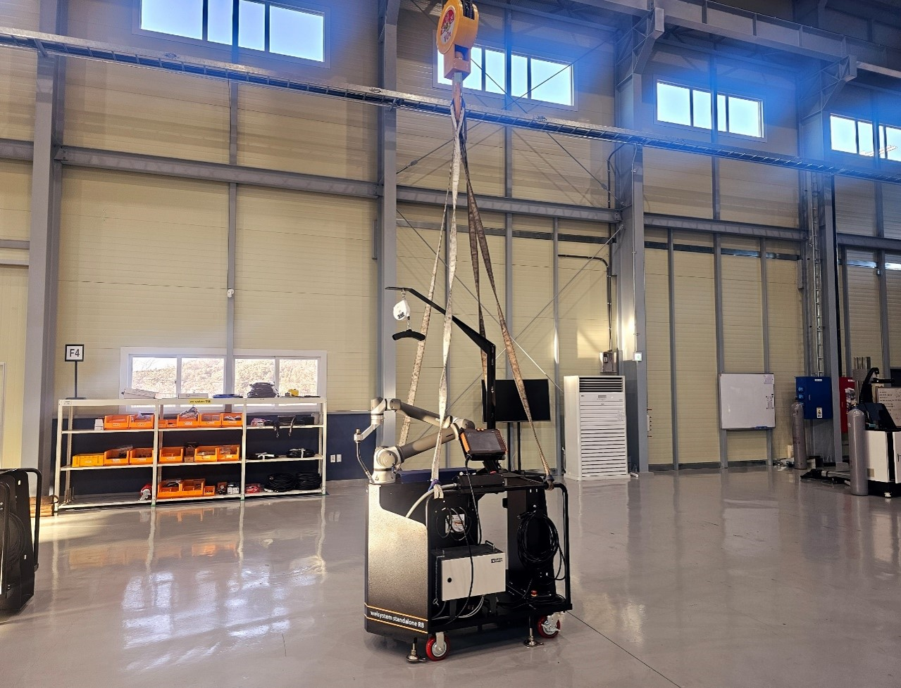
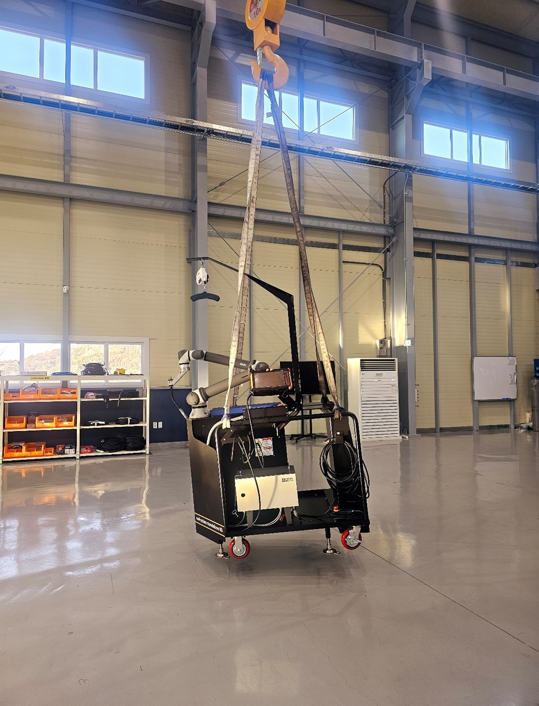
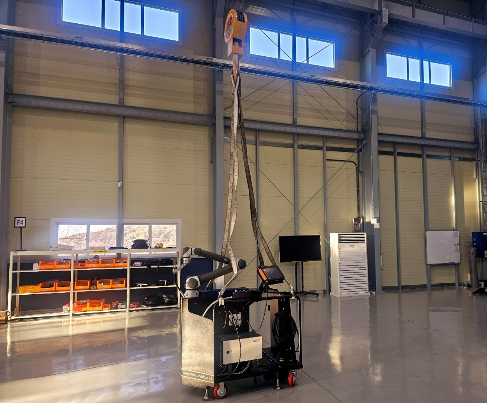

# 2.1.1 크레인 사용에 관하여

설비 위에 고정되어 있지 않은 것이 있다면 치워주십시오.

로봇에 강한 충격이 가해지지 않도록 운반에 주의하여 주십시오.

JWS의 경우 중량은 약 350Kg 입니다.

크레인으로 운반시 바가 설비의 물건에 손상을 입히지 않도록 주의하여 주십시오.

크레인을 사용한 제어기 운반 시 아래 사항을 확인하여 주십시오.

> 바가 4개소에 훌쳐서 걸렸는지 확인합니다.
>
> 바가 설비를 견딜 수 있도록 충분한 강도를 가지고 있는지 확인하십시오.



평평한 지면에 위치시킨다.

<figure><figcaption></figcaption></figure>



길이가 같은 크레인 바 4개를 이용하여 아래와 같은 위치 4개소에 바를 고정시킨다.

<figure><figcaption></figcaption></figure> <figure><figcaption></figcaption></figure>

<figure><figcaption></figcaption></figure> <figure><figcaption></figcaption></figure>




크레인을 제품에 간섭되지 않는 곳에 위치시킨 후, 크레인 훅에 바를 고정한다.

<figure><figcaption></figcaption></figure>



4개의 바가 후크에 장착된 것을 확인한 후 저속으로 상승한다.

<figure><figcaption></figcaption></figure>



이동할 위치에 도달한 후, 저속으로 하강한다.

<figure><figcaption></figcaption></figure>


