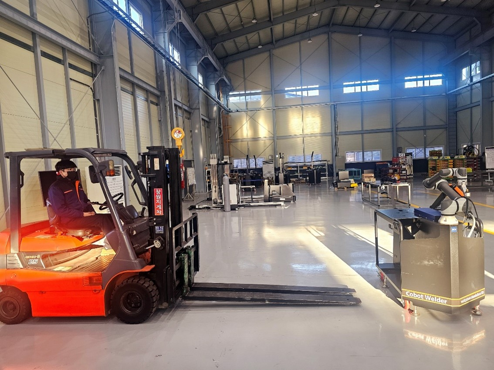
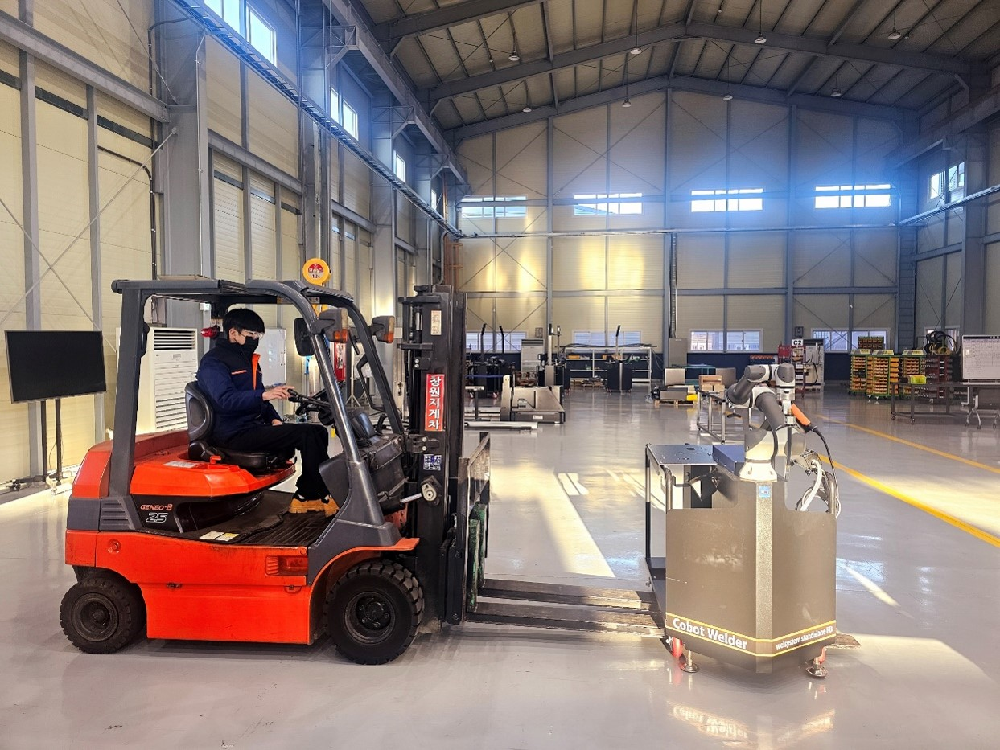
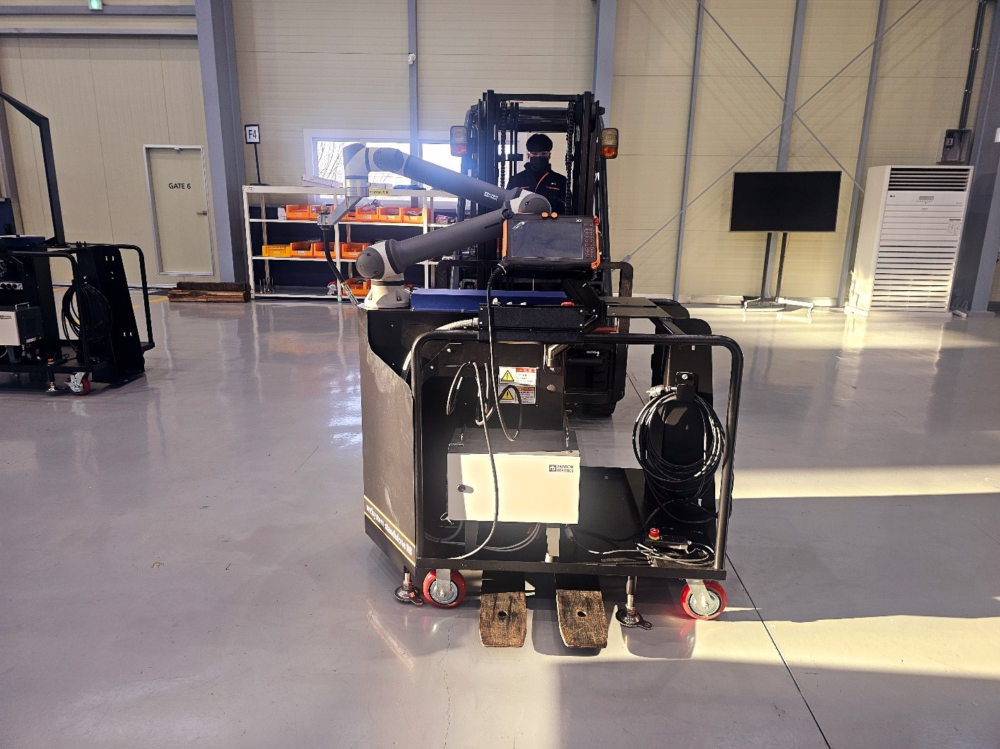

# 2.1.2 지게차의 사용에 관하여

설비 위에 고정되어 있지 않은 것이 있다면 치워주십시오.

로봇에 강한 충격이 가해지지 않도록 운반에 주의하여 주십시오.

JWS의 경우 중량은 약 350Kg 입니다.

지게차를 사용한 제어기 운반 시 아래 사항을 확인하여 주십시오.

> 가능한 낮게하여 운반하십시오.
>
> 무게중심에 맞게 지게차 발 폭을 조정하십시오.



평평한 지면에 위치시킨다.

<figure><figcaption></figcaption></figure>



지게차를 아래와 같은 방향으로 천천히 진입한다.

<figure><figcaption></figcaption></figure>

주의) 진입시 간섭되는 곳이 없도록 지게차 발 폭을 조절한다.

<figure><figcaption></figcaption></figure>



저속으로 상승한다.

<figure><figcaption></figcaption></figure>



이동할 위치에 도달한 후, 저속으로 하강한다.

<figure><figcaption></figcaption></figure>


