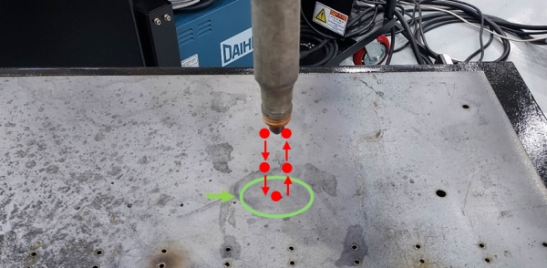
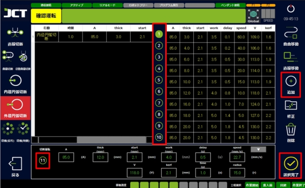
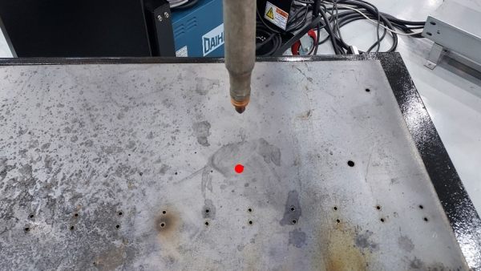
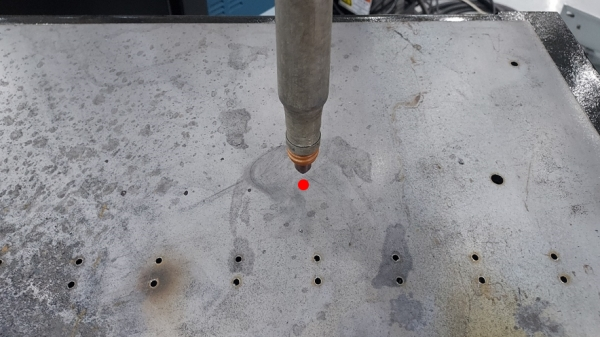
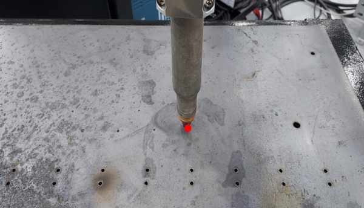

# 9.7. 外径円弧切断

外径円弧切断は素材を切断して円弧状の素材を得ようとするときに使用されます。設定した円の外側から切っていきます。\
切断には電流(A)、Start(mm)、Work(mm)、Delay(s)、Speed(mm/s)、電圧(V)、kerf(mm)、time(s)、Radius(r)の設定が使用されるので必ず入力してください。

<figure><figcaption></figcaption></figure>

***



外径円弧切断するポイントを設定しまう。

<figure><figcaption></figcaption></figure>



メイン画面で切断条件選択をクリックします。

<figure><figcaption></figcaption></figure>



外径円弧切断＞切断条件の選択＞追加＞設定完了を行います。

<figure><figcaption></figcaption></figure>



作業の開始位置を教示します。

<figure><figcaption></figcaption></figure>



作業進入前の位置を教示します。

<figure><figcaption></figcaption></figure>



外径円弧切断する位置を教示します。（円弧の中心）

<figure><figcaption></figcaption></figure>



作業完了後、回避位置を教示します。

<figure><figcaption></figcaption></figure>



作業終了位置の教示します。

<figure><figcaption></figcaption></figure>



実行ボタンを押して切断を行います。

<figure><figcaption></figcaption></figure>


